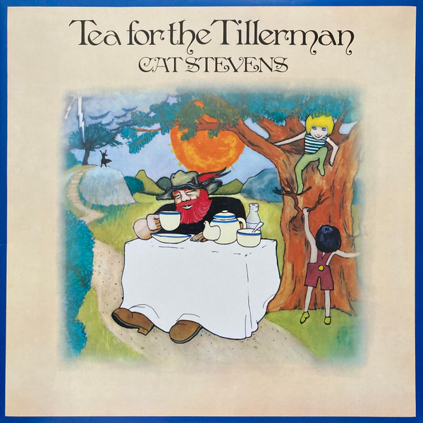

# Tea For The Tillerman

By Cat Stevens

## Album Data

- Catalog #: Roon
- Format: Digital, Album

## Track listing

1. Where Do the Children Play?
2. Hard Headed Woman
3. Wild World
4. Sad Lisa
5. Miles From Nowhere
6. But I Might Die Tonight (From the Film "Deep End")
7. Longer Boats
8. Into White
9. On the Road to Find Out
10. Father and Son (From the Film "Revolussia")
11. Tea for the Tillerman

## See also

- [Harold and Maude [Original Motion Picture Soundtrack]](Harold_and_Maude_[Original_Motion_Picture_Soundtrack].md)
- [Beets: Mona Bone Jakon](../../Beets/Cat_Stevens/Mona_Bone_Jakon.md)
- [Beets: Tea for the Tillerman](../../Beets/Cat_Stevens/Tea_for_the_Tillerman.md)
- [Vinyl: ](../../Vinyl/Cat_Stevens/Cat_Stevens.md)
- [Vinyl: Tea For The Tillerman](../../Vinyl/Cat_Stevens/Tea_For_The_Tillerman.md)
