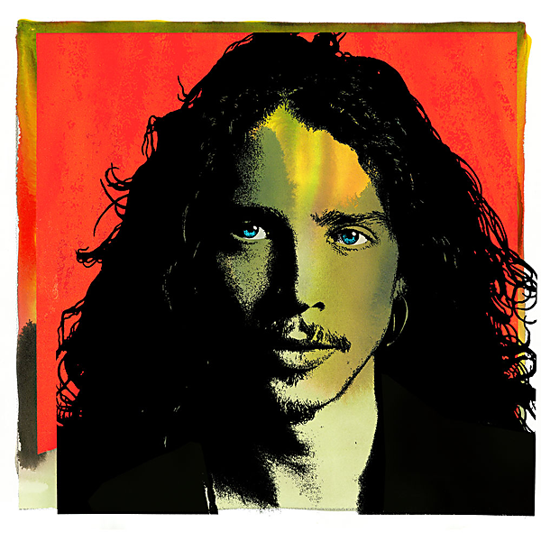

# Chris Cornell (Deluxe Edition)

By Chris Cornell

## Album Data

- Catalog #: Roon
- Format: Digital, Album

## Track listing

1-1 Hunted Down
1-2 Kingdom of Come
1-3 Flower
1-4 All Your Lies
1-5 Loud Love
1-6 Hands All Over
1-7 Say Hello 2 Heaven (25th anniversary mix)
1-8 Hunger Strike (25th anniversary mix)
1-9 Outshined
1-10 Rusty Cage
1-11 Seasons
1-12 Hey Baby (Land of the New Rising Sun)
1-13 Black Hole Sun
1-14 Spoonman
1-15 Dusty
1-16 Burden in My Hand
2-1 Sunshower
2-2 Sweet Euphoria
2-3 Can't Change Me
2-4 Like a Stone
2-5 Cochise
2-6 Be Yourself
2-7 Doesn't Remind Me
2-8 Revelations
2-9 Shape of Things to Come
2-10 You Know My Name (from "Casino Royale" soundtrack)
2-11 Billie Jean
2-12 Long Gone [Rock Version]
2-13 Scream
2-14 Part of Me [Steve Aoki Remix]
2-15 Ave Maria
3-1 Promise
3-2 Whole Lotta Love
3-3 Call Me a Dog [Live Acoustic]
3-4 Imagine [Live Acoustic]
3-5 I Am the Highway [Live Acoustic]
3-6 The Keeper
3-7 Been Away Too Long
3-8 Live to Rise
3-9 Lies
3-10 Misery Chain
3-11 Storm
3-12 Nearly Forgot My Broken Heart
3-13 Only These Words
3-14 Our Time in the Universe
3-15 'til the Sun Comes Back Around (from "13 Hours: The Secret Soldiers of Benghazi")
3-16 Stay With Me Baby (from "Vinyl")
3-17 The Promise
3-18 When Bad Goes Good
4-1 Into the Void (Sealth) [Live at the Paramount]
4-2 Mind Riot [Live at the Paramount]
4-3 Nothing to Say [Live in Seattle]
4-4 Jesus Christ Pose [Live in Oakland]
4-5 Show Me How to Live [Live in Cuba]
4-6 Wide Awake [Live in Sweden]
4-7 All Night Thing [Live in Sweden]
4-8 Nothing Compares 2 U [Live at Sirius XM]
4-9 One [Live at Beacon Theatre]
4-10 Reach Down [Live at the Paramount]
4-11 Stargazer [Live at the Paramount]
4-12 Wild World [Live at Pantages Theatre]
4-13 A Day in the Life [Live at the Royal Albert Hall]
4-14 Redemption Song [Live at Beacon Theatre]
4-15 Thank You [Live in Sweden]

