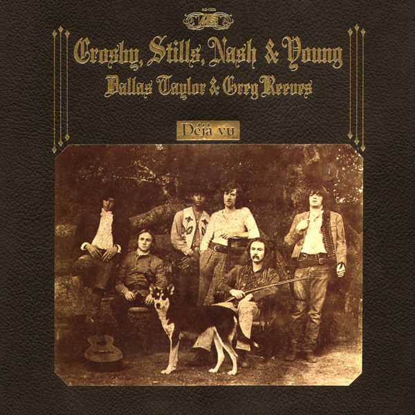

# Déjà Vu

By Crosby, Stills, Nash & Young

## Album Data

- Catalog #: Roon
- Format: Digital, Album

## Track listing

1-1 Carry On
1-2 Teach Your Children
1-3 Almost Cut My Hair
1-4 Helpless
1-5 Woodstock
1-6 Déjà Vu
1-7 Our House
1-8 4 + 20
1-9 Country Girl: Whiskey Boot Hill/Down, Down, Down/"Country Girl" (I ...)
1-10 Everybody I Love You
2-1 Our House [Demo]
2-2 4 + 20 [Demo]
2-3 Song With No Words (Tree with No Leaves) [demo]
2-4 Birds [Demo]
2-5 So Begins the Task/Hold On Tight [Demo]
2-6 Right Between the Eyes [Demo]
2-7 Almost Cut My Hair [Demo]
2-8 Teach Your Children [Demo]
2-9 How Have You Been [Demo]
2-10 Triad [Demo]
2-11 Horses Through a Rainstorm [Demo]
2-12 Know You Got to Run [Demo]
2-13 Question Why [Demo]
2-14 Laughing [Demo]
2-15 She Can't Handle It [Demo]
2-16 Sleep Song [Demo]
2-17 Déjà Vu [Demo]
2-18 Our House [Demo]
3-1 Everyday We Live [Outtake]
3-2 The Lee Shore [1969 Vocal] [Outtake]
3-3 I'll Be There [Outtake]
3-4 Bluebird Revisited [Outtake]
3-5 Horses Through a Rainstorm [Outtake]
3-6 30 Dollar Fine [Outtake]
3-7 Ivory Tower [Outtake]
3-8 Same Old Song [Outtake]
3-9 Hold On Tight/Change Partners [Outtake]
3-10 Laughing [Outtake]
3-11 Right on Rock 'N' Roll [Outtake]
4-1 Carry On [Early Alternate Mix]
4-2 Teach Your Children [Early Version]
4-3 Almost Cut My Hair [Early Version]
4-4 Helpless [Harmonica Version]
4-5 Woodstock [Alternate Vocals]
4-6 Déjà Vu [Early Alternate Mix]
4-7 Our House [Early Version]
4-8 4 + 20 [Alternate Take 2]
4-9 Know You Got to Run [Alternate]

