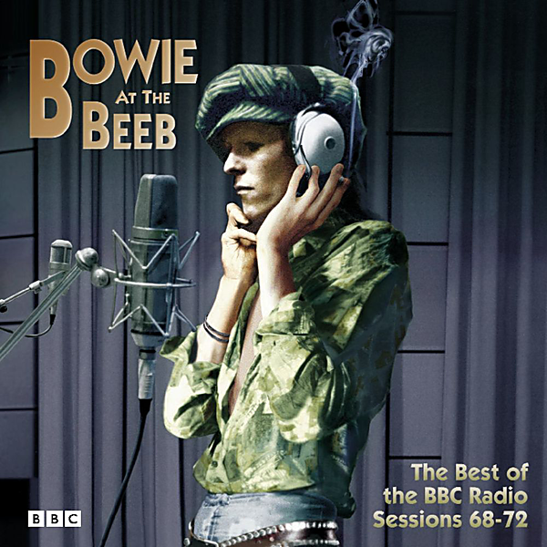

# Bowie at the Beeb (The Best of the BBC Sessions 1968-1972)

By David Bowie

## Album Data

- Catalog #: Roon
- Format: Digital, Album

## Track listing

1-1 In the Heat of the Morning [John Peel - Top Gear, Recorded 13.5.68]
1-2 London Bye Ta Ta
1-3 Karma Man [John Peel - Top Gear, Recorded 13.5.68]
1-4 Silly Boy Blue [John Peel - Top Gear, Recorded 13.5.68]
1-5 Let Me Sleep Beside You [Dave Lee Travis Show - Recorded 20.10.69]
1-6 Janine [Dave Lee Travis Show - Recorded 20.10.69]
1-7 Amsterdam
1-8 God Knows I'm Good [The Sunday Show - Recorded 5.2.70]
1-9 The Width of a Circle [The Sunday Show - Recorded 5.2.70]
1-10 Unwashed and Somewhat Slightly Dazed [The Sunday Show - Recorded 5.2.70]
1-11 Cygnet Committee [The Sunday Show - Recorded 5.2.70]
1-12 Memory of a Free Festival [The Sunday Show - Recorded 5.2.70]
1-13 Wild Eyed Boy From Freecloud [Sounds of the 70s - Andy Ferris, Recorded 25.3.70]
1-14 Bombers [In Concert, John Peel, Recorded 3.6.71]
1-15 Looking for a Friend [In Concert, John Peel, Recorded 3.6.71]
1-16 Almost Grown [In Concert, John Peel, Recorded 3.6.71]
1-17 Kooks [In Concert, John Peel, Recorded 3.6.71]
1-18 It Ain't Easy [In Concert, John Peel, Recorded 3.6.71]
2-1 The Supermen [Sounds of the 70s - Bob Harris, Recorded 21.9.71]
2-2 Eight Line Poem [Sounds of the 70s - Bob Harris, Recorded 21.9.71]
2-3 Hang On to Yourself [Sounds of the 70s - Bob Harris Recorded 18.1.72]
2-4 Ziggy Stardust [Sounds of the 70s - Bob Harris Recorded 18.1.72]
2-5 Queen Bitch [Sounds of the 70s - Bob Harris Recorded 18.1.72]
2-6 I'm Waiting for the Man
2-7 Five Years [Sounds of the 70s - Bob Harris Recorded 18.1.72]
2-8 White Light/White Heat [Sounds of the 70s - John Peel, Recorded 16.5.72]
2-9 Moonage Daydream [Sounds of the 70s - John Peel, Recorded 16.5.72]
2-10 Hang On to Yourself [Sounds of the 70s - John Peel, Recorded 16.5.72]
2-11 Suffragette City [Sounds of the 70s - John Peel, Recorded 16.5.72]
2-12 Ziggy Stardust [Sounds of the 70s - John Peel, Recorded 16.5.72]
2-13 Starman [Johnnie Walker - Lunchtime Show, Recorded 22.5.72]
2-14 Space Oddity [Johnnie Walker - Lunchtime Show, Recorded 22.5.72]
2-15 Changes [Johnnie Walker - Lunchtime Show, Recorded 22.5.72]
2-16 Oh! You Pretty Things [Johnnie Walker - Lunchtime Show, Recorded 22.5.72]
2-17 Andy Warhol [Sounds of the 70s - Bob Harris, Recorded 23.5.72]
2-18 Lady Stardust [Sounds of the 70s - Bob Harris, Recorded 23.5.72]
2-19 Rock & Roll With Me

