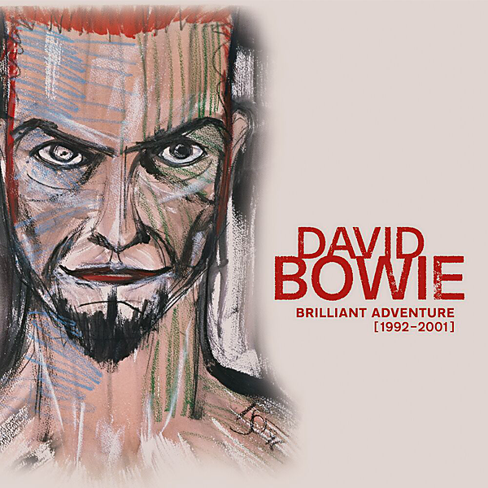

# Brilliant Adventure (1992 – 2001)

By David Bowie

## Album Data

- Catalog #: Roon
- Format: Digital, Album

## Track listing

1-1 The Wedding
1-2 You've Been Around
1-3 I Feel Free
1-4 Black Tie White Noise
1-5 Jump They Say
1-6 Nite Flights
1-7 Pallas Athena
1-8 Miracle Goodnight
1-9 Don't Let Me Down & Down
1-10 Looking for Lester
1-11 I Know It's Gonna Happen Someday
1-12 The Wedding Song
2-1 Buddha of Suburbia
2-2 Sex and the Church
2-3 South Horizon
2-4 The Mysteries
2-5 Bleed Like a Craze, Dad
2-6 Strangers When We Meet [Buddha Version]
2-7 Dead Against It
2-8 Untitled No. 1
2-9 Ian Fish, U.K. Heir
2-10 Buddha of Suburbia
3-1 Leon Takes Us Outside
3-2 Outside
3-3 The Hearts Filthy Lesson
3-4 A Small Plot of Land
3-5 Segue: Baby Grace (A Horrid Cassette)
3-6 Hallo Spaceboy
3-7 The Motel
3-8 I Have Not Been to Oxford Town
3-9 No Control
3-10 Segue: Algeria Touchshriek
3-11 The Voyeur of Utter Destruction (As Beauty)
3-12 Segue: Ramona A. Stone/I Am with Name
3-13 Wishful Beginnings
3-14 We Prick You
3-15 Segue: Nathan Adler, Pt. 1
3-16 I'm Deranged
3-17 Thru' These Architects Eyes
3-18 Segue: Nathan Adler, Pt. 2
3-19 Strangers When We Meet
4-1 Little Wonder
4-2 Looking for Satellites
4-3 Battle for Britain (The Letter)
4-4 Seven Years in Tibet
4-5 Dead Man Walking
4-6 Telling Lies
4-7 The Last Thing You Should Do
4-8 I'm Afraid of Americans
4-9 Law (Earthlings on Fire)
5-1 Thursday's Child
5-2 Something in the Air
5-3 Survive
5-4 If I'm Dreaming My Life
5-5 Seven
5-6 What's Really Happening?
5-7 The Pretty Things Are Going to Hell
5-8 New Angels of Promise
5-9 Brilliant Adventure
5-10 The Dreamers
6-1 Wild Is the Wind [Live]
6-2 Ashes to Ashes [Live]
6-3 Seven [Live]
6-4 This Is Not America [Live]
6-5 Absolute Beginners [Live]
6-6 Always Crashing in the Same Car [Live]
6-7 Survive [Live]
6-8 The London Boys [Live]
6-9 I Dig Everything [Live]
6-10 Little Wonder [Live]
7-1 The Man Who Sold the World [Live]
7-2 Fame [Live]
7-3 Stay [Live]
7-4 Hallo Spaceboy [Live]
7-5 Cracked Actor [Live]
7-6 I'm Afraid of Americans [Live]
7-7 All the Young Dudes [Live]
7-8 Starman [Live]
7-9 "Heroes" [Live]
7-10 Let's Dance [Live]
8-1 I Dig Everything
8-2 You've Got a Habit of Leaving
8-3 The London Boys
8-4 Karma Man
8-5 Conversation Piece
8-6 Shadow Man
8-7 Let Me Sleep Beside You
8-8 Hole in the Ground
8-9 Baby Loves That Way
8-10 Can't Help Thinking About Me
8-11 Silly Boy Blue
8-12 Toy (Your Turn to Drive)
9-1 Real Cool World [Sounds From the Cool World Soundtrack Version]
9-2 Jump They Say [7" Version]
9-3 Lucy Can't Dance
9-4 Black Tie White Noise [Radio Edit]
9-5 Don't Let Me Down & Down [Indonesian Vocal Version]
9-6 Buddha of Suburbia [Single Version]
9-7 The Hearts Filthy Lesson [Radio Edit]
9-8 Nothing to Be Desired
9-9 Strangers When We Meet [Edit]
9-10 Get Real
9-11 The Man Who Sold the World [Live Eno Mix]
9-12 I'm Afraid of Americans [Showgirls Soundtrack Version]
9-13 Hallo Spaceboy [Remix]
9-14 I Am with Name [Alternative Version]
9-15 A Small Plot of Land [Long Basquiat Soundtrack Version]
10-1 Little Wonder [Edit]
10-2 A Fleeting Moment (Seven Years in Tibet) [Mandarin Version]
10-3 Dead Man Walking [Edit]
10-4 Seven Years in Tibet [Edit]
10-5 Planet of Dreams
10-6 I'm Afraid of Americans [V1-Edit]
10-7 I Can't Read [The Ice Storm Long Version]
10-8 A Foggy Day in London Town
10-9 Fun [BowieNet Mix]
10-10 The Pretty Things Are Going to Hell [Stigmata Soundtrack Version]
10-11 Thursday's Child [Radio Edit]
10-12 We All Go Through
10-13 No One Calls
11-1 We Shall Go to Town
11-2 1917
11-3 The Pretty Things Are Going to Hell [Edit]
11-4 Thursday's Child [Omikron: The Nomad Soul Version]
11-5 New Angels of Promise [Omikron: The Nomad Soul Version]
11-6 The Dreamers [Omikron: The Nomad Soul Version]
11-7 Seven [Demo]
11-8 Survive [Marius de Vries Mix]
11-9 Something in the Air [American Psycho Remix]
11-10 Seven [Marius de Vries Mix]
11-11 Pictures of Lily

