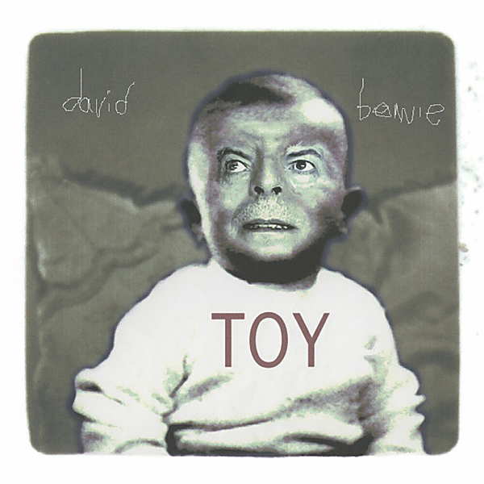

# Toy (Toy:Box)

By David Bowie

## Album Data

- Catalog #: Roon
- Format: Digital, Album

## Track listing

1-1 I Dig Everything
1-2 You've Got a Habit of Leaving
1-3 The London Boys
1-4 Karma Man
1-5 Conversation Piece
1-6 Shadow Man
1-7 Let Me Sleep Beside You
1-8 Hole in the Ground
1-9 Baby Loves That Way
1-10 Can't Help Thinking About Me
1-11 Silly Boy Blue
1-12 Toy (Your Turn to Drive)
2-1 Liza Jane [Alternative Mix]
2-2 You've Got a Habit of Leaving [Alternative Mix]
2-3 Baby Loves That Way [Alternative Mix]
2-4 Can't Help Thinking About Me [Alternative Mix]
2-5 I Dig Everything [Alternative Mix]
2-6 The London Boys [Alternative Version]
2-7 Silly Boy Blue [Tibet Version]
2-8 Let Me Sleep Beside You [Alternative Mix]
2-9 In the Heat of the Morning [Alternative Mix]
2-10 Conversation Piece [Alternative Mix]
2-11 Hole in the Ground [Alternative Mix]
2-12 Shadow Man [Alternative Mix]
2-13 Toy (Your Turn to Drive) [Alternative Mix]
3-1 In the Heat of the Morning [Unplugged & Somewhat Slightly Electric Mix]
3-2 I Dig Everything [Unplugged & Somewhat Slightly Electric Mix]
3-3 You've Got a Habit of Leaving [Unplugged & Somewhat Slightly Electric Mix]
3-4 The London Boys [Unplugged & Somewhat Slightly Electric Mix]
3-5 Karma Man [Unplugged & Somewhat Slightly Electric Mix]
3-6 Conversation Piece [Unplugged & Somewhat Slightly Electric Mix]
3-7 Shadow Man [Unplugged & Somewhat Slightly Electric Mix]
3-8 Let Me Sleep Beside You [Unplugged & Somewhat Slightly Electric Mix]
3-9 Hole in the Ground [Unplugged & Somewhat Slightly Electric Mix]
3-10 Baby Loves That Way [Unplugged & Somewhat Slightly Electric Mix]
3-11 Can't Help Thinking About Me [Unplugged & Somewhat Slightly Electric Mix]
3-12 Silly Boy Blue [Unplugged & Somewhat Slightly Electric Mix]
3-13 Toy (Your Turn to Drive) [Unplugged & Somewhat Slightly Electric Mix]

