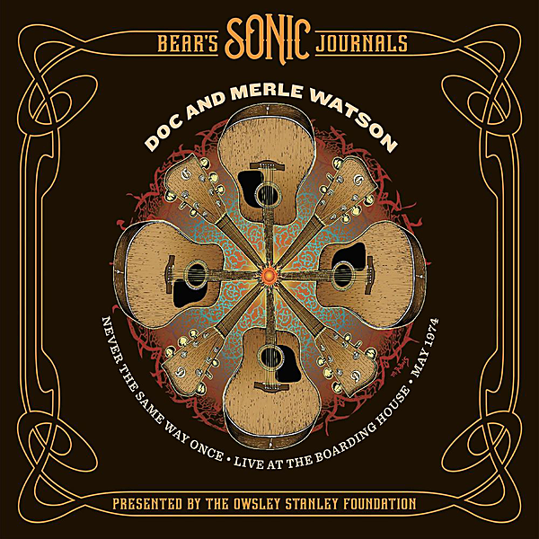

# Bear's Sonic Journals: Never the Same Way Once (Live)

By Doc & Merle Watson

## Album Data

- Catalog #: Roon
- Format: Digital, Album

## Track listing

1-1 Salty Dog Blues (live)
1-2 Frosty Morn (live)
1-3 Matchbox Blues (live)
1-4 Deep Elem Blues (live)
1-5 Good Old Mountain Dew (live)
1-6 Travellin' Man (live)
1-7 Sweet Georgia Brown (live)
1-8 Lonesome Moan (live)
1-9 Clouds Gwine Roll Away (live)
1-10 Three Times Seven (live)
1-11 Peach Pickin' Time in Georgia (live)
1-12 Walk on Boy (live)
1-13 Nothin' to It (live)
1-14 Blue Railroad Train (live)
1-15 Brown's Ferry Blues (live)
1-16 Beaumont Rag (live)
1-17 Doc's Guitar (live)
2-1 Mama Don't Allow (live)
2-2 Freight Train Boogie (live)
2-3 Miss the Mississippi and You (live)
2-4 Bye Bye Bluebell (live)
2-5 Way Down Town (live)
2-6 Poor Boy Blues (live)
2-7 Nancy Rowland/Old Joe Clark (live)
2-8 The Last Thing on My Mind (live)
2-9 Solid Gone (live)
2-10 South Coast (live)
2-11 Going Down the Road Feelin' Bad (live)
2-12 Wabash Cannonball (live)
2-13 Black Mountain Rag (live)
2-14 Tennessee Stud (live)
2-15 Step It Up and Go (live)

