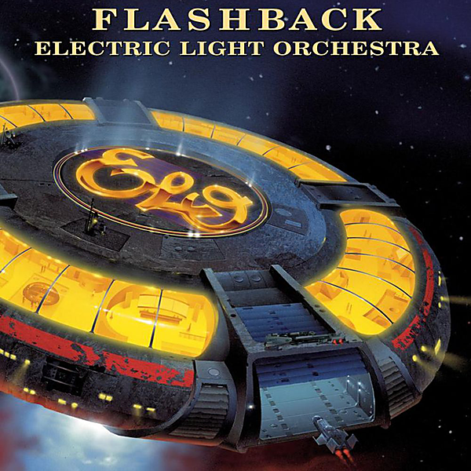

# Flashback

By Electric Light Orchestra

## Album Data

- Catalog #: Roon
- Format: Digital, Album

## Track listing

1-1 10538 Overture
1-2 Showdown
1-3 Ma-Ma-Ma Belle
1-4 Mr. Radio
1-5 Roll Over Beethoven
1-6 Mama (new edit)
1-7 One Summer Dream
1-8 Illusions in G Major
1-9 Strange Magic
1-10 Eldorado Overture
1-11 Can't Get It Out of My Head
1-12 Eldorado
1-13 Eldorado Finale
1-14 Do Ya (alternative mix)
1-15 Mister Kingdom
1-16 Grieg's Piano Concerto in A Minor
2-1 Tightrope
2-2 Evil Woman
2-3 Livin' Thing
2-4 Mr. Blue Sky
2-5 Mission (A World Record) (alternative mix)
2-6 Turn to Stone
2-7 Telephone Line
2-8 Rockaria!
2-9 Starlight
2-10 It's Over
2-11 The Whale
2-12 Sweet Talkin' Woman
2-13 Big Wheels
2-14 Shangri-La
2-15 Nightrider
2-16 Tears In Your Life
3-1 Don't Bring Me Down
3-2 The Diary of Horace Wimp
3-3 Twilight
3-4 Secret Messages
3-5 Take Me On and On
3-6 Shine a Little Love
3-7 Rock & Roll Is King
3-8 Last Train to London
3-9 Confusion
3-10 Getting to the Point
3-11 Hold on Tight
3-12 So Serious
3-13 Calling America
3-14 Four Little Diamonds
3-15 Great Balls of Fire
3-16 Xanadu (new version)
3-17 Indian Queen (demo)
3-18 Love Changes All
3-19 After All
3-20 Helpless
3-21 Who's That

