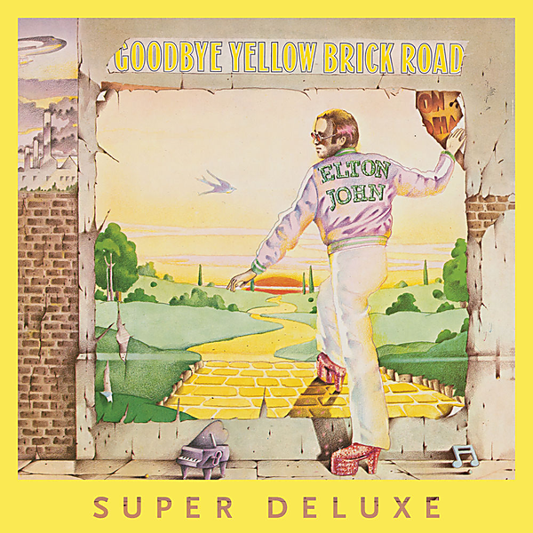

# Goodbye Yellow Brick Road (40th Anniversary Celebration)

By Elton John

## Album Data

- Catalog #: Roon
- Format: Digital, Album

## Track listing

1. Funeral for a Friend/Love Lies Bleeding
2. Candle in the Wind
3. Bennie and the Jets [Live Version]
4. Goodbye Yellow Brick Road
5. This Song Has No Title
6. Grey Seal
7. Jamaica Jerk-Off
8. I've Seen That Movie Too
9. Sweet Painted Lady
10. The Ballad of Danny Bailey [1909-1934]
11. Dirty Little Girl
12. All the Girls Love Alice
13. Your Sister Can't Twist (But She Can Rock 'n Roll)
14. Saturday Night's Alright for Fighting
15. Roy Rogers
16. Social Disease
17. Harmony

