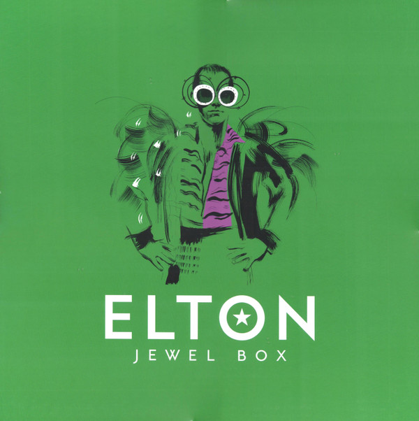

# Jewel Box

By Elton John

## Album Data

- Catalog #: Roon
- Format: Digital, Album

## Track listing

1-1 Monkey Suit
1-2 Where to Now St Peter?
1-3 Mellow
1-4 The Ballad of Danny Bailey (1909-34)
1-5 Chameleon
1-6 Gone to Shiloh
1-7 We All Fall in Love Sometimes
1-8 Too Low for Zero
1-9 The Power
1-10 All That I'm Allowed (I'm Thankful)
1-11 The Bridge
1-12 The New Fever Waltz
1-13 Stones Throw From Hurtin'
1-14 The North
1-15 Hoop of Fire
1-16 Boogie Pilgrim
2-1 Ticking
2-2 Crystal
2-3 All Quiet on the Western Front
2-4 Tell Me When the Whistle Blows
2-5 Freaks in Love
2-6 Never Too Old (to Hold Somebody)
2-7 The Emperor's New Clothes
2-8 House
2-9 (Gotta Get A) Meal Ticket
2-10 Understanding Women
2-11 Shoot Down the Moon
2-12 Have Mercy on the Criminal
2-13 Blues for Baby and Me
2-14 My Quicksand
2-15 Street Kids
3-1 Come Back Baby [Bluesology]
3-2 Mr. Frantic [Bluesology]
3-3 Scarecrow [Piano/Tambourine Demo]
3-4 A Dandelion Dies in the Wind [Piano Demo]
3-5 Velvet Fountain [Piano Demo]
3-6 A Little Love Goes a Long Way [Piano Demo]
3-7 If You Could See Me Now [Piano Demo]
3-8 Mr. Lightning Strikerman [Piano Demo]
3-9 Countryside Love Affair [Piano Demo]
3-10 I Could Never Fall in Love With Anybody Else [Piano Demo]
3-11 I Get a Little Bit Lonely [Piano Demo]
3-12 The Witch's House [Piano Demo]
3-13 Get Out of This Town [Piano/Tambourine Demo]
3-14 Year of the Teddy Bear [Piano Demo]
3-15 Where It's At [Piano/Percussion Demo]
3-16 Who's Gonna Love You [Piano/Percussion Demo]
3-17 Nina [Band Version]
3-18 Angel Tree [Piano/Guitar/Tambourine Demo]
3-19 Here's to the Next Time [Piano/Tambourine Demo]
3-20 Thank You for All Your Loving [Band Version]
3-21 Watching the Planes Go By [Band Version]
3-22 When the First Tear Shows [Arranged Band Version]
3-23 Tartan Coloured Lady [Arranged Band Version]
4-1 Hourglass [Arranged Band Version]
4-2 71-75 New Oxford Street [Band Demo]
4-3 Turn to Me [Arranged Band Version]
4-4 Reminds Me of You [Piano Demo]
4-5 I Can't Go on Living Without You [Arranged Band Demo]
4-6 And the Clock Goes Round [Piano Demo]
4-7 When I Was Tealby Abbey [Piano Demo]
4-8 I'll Stop Living When You Stop Loving Me [Piano Demo]
4-9 Trying to Hold on to a Love That's Dying [Piano Demo]
4-10 Sitting Doing Nothing [Band Version]
4-11 Regimental Sgt. Zippo [Band Version]
4-12 Cry Willow Cry [Band Demo]
4-13 There Is Still a Little Love [Band Demo]
4-14 If I Asked You [Band Demo]
4-15 Skyline Pigeon [Piano Demo]
4-16 Two of a Kind [Arranged Band Demo]
4-17 The Girl on Angel Pavement [Arranged Band Demo]
4-18 Smokestack Children [Arranged Band Demo]
4-19 Baby I Miss You [Band Demo]
4-20 All Across the Havens [Piano/Guitar Demo]
4-21 Bonnie's Gone Away [Piano/Guitar Demo]
4-22 Just an Ordinary Man [Piano Demo]
4-23 There's Still Time for Me [Piano/Guitar/Tambourine Demo]
5-1 The Tide Will Turn for Rebecca [Piano Demo]
5-2 Dick Barton Theme (Devil's Gallop)
5-3 Breakdown Blues
5-4 Taking the Sun From My Eyes [Arranged Band Version]
5-5 It's Me That You Need [Band Demo]
5-6 Sing Me No Sad Songs [Band Demo]
5-7 The Flowers Will Never Die [Piano Demo]
5-8 In The Morning [Band Demo]
5-9 Open Your Eyes to the Sun [Band Demo]
5-10 One Time, Sometime Or Never [Band Demo]
5-11 Slow Fade to Blue [Piano/Guitar Demo]
5-12 Rolling Western Union [Piano Demo]
5-13 My Father's Gun [Piano Demo]
5-14 Amoreena [Piano Demo]
5-15 Burn Down the Mission [Piano Demo]
5-16 Razor Face [Piano Demo]
5-17 Madman Across the Water [Piano Demo]
5-18 Holiday Inn [Piano Demo]
5-19 All the Nasties [Piano Demo]
6-1 Snow Queen
6-2 Conquer the Sun
6-3 Cartier
6-4 White Man Danger
6-5 Tactics
6-6 Steal Away Child
6-7 Love So Cold
6-8 Les Aveux
6-9 Donner Pour Donner
6-10 J'veux D'la Tendresse
6-11 Fools in Fashion
6-12 Can't Get Over Getting Over Losing You
6-13 Tortured
6-14 Hey Papa Legba
6-15 Take Me Down to the Ocean
6-16 Where Have All the Good Times Gone? [Alternate Mix]
6-17 The Retreat
6-18 Choc Ice Goes Mental
6-19 A Simple Man
7-1 Lonely Boy
7-2 Highlander
7-3 Billy and the Kids
7-4 Lord of the Flies
7-5 Rope Around a Fool
7-6 Medicine Man
7-7 I Know Why I'm in Love
7-8 Big Man in a Little Suit
7-9 God Never Came Here
7-10 The North Star
7-11 Did Anybody Sleep With Joan of Arc
7-12 So Sad the Renegade
7-13 A Little Peace
7-14 Keep It a Mystery
7-15 How's Tomorrow
7-16 Peter's Song
7-17 Things Only Get Better With Love
8-1 Empty Sky
8-2 Lady Samantha
8-3 Border Song
8-4 My Father's Gun
8-5 All the Nasties
8-6 I Think I'm Going to Kill Myself
8-7 Philadelphia Freedom
8-8 Song for Guy (single edit)
8-9 Sartorial Eloquence
8-10 Elton's Song
8-11 Cold as Christmas (in the Middle of the Year)
8-12 I Fall Apart
8-13 Amazes Me
8-14 The Last Song
8-15 American Triangle
8-16 (I'm Gonna) Love Me Again

