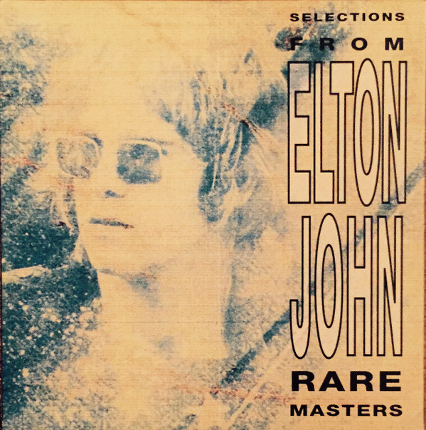

# Rare Masters

By Elton John

## Album Data

- Catalog #: Roon
- Format: Digital, Album

## Track listing

1-1 I've Been Loving You
1-2 Here's to the Next Time
1-3 Lady Samantha
1-4 All Across the Havens
1-5 It's Me That You Need
1-6 Just Like Strange Rain
1-7 Bad Side of the Moon [Single Version]
1-8 Rock & Roll Madonna
1-9 Grey Seal [Version 1970]
1-10 Friends [From Friends]
1-11 Michelle's Song [From Friends]
1-12 Seasons [From Friends]
1-13 Variation on Michelle's Song (A Day in the Country) [From Friends]
1-14 Can I Put You On [From Friends]
1-15 Honey Roll [From Friends]
1-16 Variation on Friends [From Friends]
1-17 I Meant to Do My Work Today (A Day in the Country) [From Friends]
1-18 Four Moods [From Friends]
1-19 Seasons Reprise
2-1 Madman Across the Water
2-2 Into the Old Man's Shoes
2-3 Rock Me When He's Gone
2-4 Slave [Alternate "Fast" Version]
2-5 Skyline Pigeon [Piano Version]
2-6 Jack Rabbit [Single Version]
2-7 Whenever You're Ready (We'll Go Steady Again) [Single Version]
2-8 Let Me Be Your Car [Demo Version]
2-9 Screw You (Young Man's Blues)
2-10 Step into Christmas
2-11 (Ho! Ho! Ho!) Who'd Be a Turkey at Christmas
2-12 Sick City
2-13 Cold Highway
2-14 One Day (At a Time)
2-15 I Saw Her Standing There [Live From Madison Square Garden, USA, 1974]
2-16 House of Cards
2-17 Planes
2-18 Sugar on the Floor

