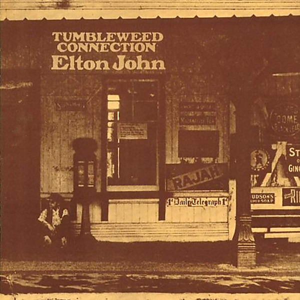

# Tumbleweed Connection (Deluxe Edition)

By Elton John

## Album Data

- Catalog #: Roon
- Format: Digital, Album

## Track listing

1-1 Ballad of a Well-Known Gun
1-2 Come Down in Time
1-3 Country Comfort
1-4 Son of Your Father
1-5 My Father's Gun
1-6 Where to Now St. Peter?
1-7 Love Song
1-8 Amoreena
1-9 Talking Old Soldiers
1-10 Burn Down the Mission
2-1 There Goes a Well Known Gun [Previously Unreleased]
2-2 Come Down in Time [Piano Demo Previously Unreleased]
2-3 Country Comfort [Piano Demo Previously Unreleased]
2-4 Son of Your Father [Previously Unreleased]
2-5 Talking Old Soldiers [Piano Demo Previously Unreleased]
2-6 Into the Old Man's Shoes [Piano Demo Previously Unreleased]
2-7 Sisters of the Cross [Piano Demo Previously Unreleased]
2-8 Madman Across the Water [Original Version]
2-9 Into the Old Man's Shoes
2-10 My Father's Gun [BBC Session]
2-11 Ballad of a Well-Known Gun [BBC Session]
2-12 Burn Down the Mission [BBC Session]
2-13 Amoreena [BBC Session]

