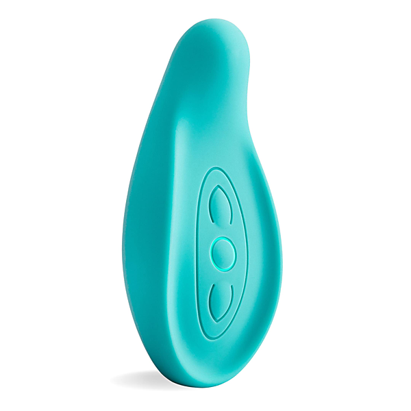

# Momofuku (Album Version)

By Elvis Costello

## Album Data

- Catalog #: Roon
- Format: Digital, Album

## Track listing

1. No Hiding Place
2. American Gangster Time
3. Turpentine
4. Harry Worth
5. Drum & Bone
6. Flutter & Wow
7. Stella Hurt
8. Mr. Feathers
9. My Three Sons
10. Song with Rose
11. Pardon Me, Madam, My Name Is Eve
12. Go Away

## See also

- [Armed Forces (Remastered 2020)](Armed_Forces_Remastered_2020.md)
- [Blood And Chocolate](Blood_And_Chocolate.md)
- [Costello](Costello-_My_Flame_Burns_Blue.md)
- [Imperial Bedroom](Imperial_Bedroom.md)
- [King Of America](King_Of_America.md)
- [My Aim Is True](My_Aim_Is_True.md)
- [Painted From Memory](Painted_From_Memory.md)
- [Secret, Profane and Sugarcane (Album Version)](Secret__Profane_and_Sugarcane_Album_Version.md)
- [Spanish Model](Spanish_Model.md)
- [This Year's Model](This_Years_Model.md)
- [Trust](Trust.md)
- [Beets: Momofuku](../../Beets/Elvis_Costello/Momofuku.md)
- [Beets: Secret, Profane & Sugarcane](../../Beets/Elvis_Costello/Secret__Profane_and_Sugarcane.md)
- [Beets: When I Was Cruel](../../Beets/Elvis_Costello/When_I_Was_Cruel.md)
- [Vinyl: ](../../Vinyl/Elvis_Costello/Elvis_Costello.md)
- [Vinyl: Taking Liberties](../../Vinyl/Elvis_Costello/Taking_Liberties.md)
