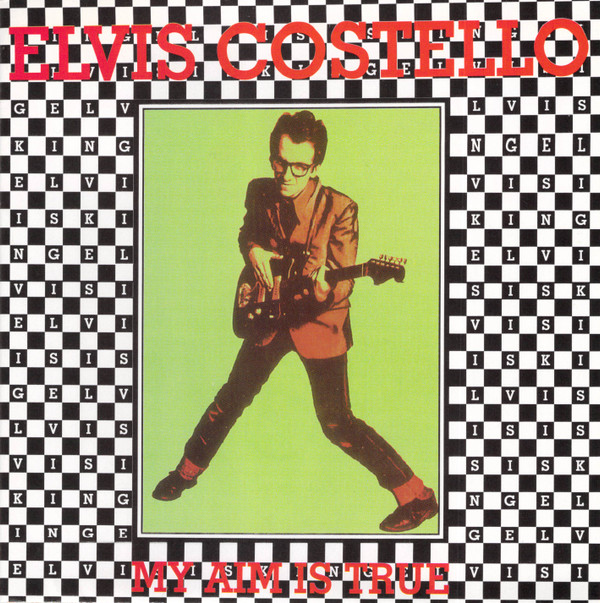

# My Aim Is True

By Elvis Costello

## Album Data

- Catalog #: Roon
- Format: Digital, Album

## Track listing

1. Welcome to the Working Week
2. Miracle Man
3. No Dancing
4. Blame It on Cain
5. Alison
6. Sneaky Feelings
7. (The Angels Wanna Wear My) Red Shoes
8. Less Than Zero
9. Mystery Dance
10. Pay It Back
11. I'm Not Angry
12. Waiting for the End of the World
13. Watching the Detectives

## See also

- [Armed Forces (Remastered 2020)](Armed_Forces_Remastered_2020.md)
- [Blood And Chocolate](Blood_And_Chocolate.md)
- [Costello](Costello-_My_Flame_Burns_Blue.md)
- [Imperial Bedroom](Imperial_Bedroom.md)
- [King Of America](King_Of_America.md)
- [Momofuku (Album Version)](Momofuku_Album_Version.md)
- [Painted From Memory](Painted_From_Memory.md)
- [Secret, Profane and Sugarcane (Album Version)](Secret__Profane_and_Sugarcane_Album_Version.md)
- [Spanish Model](Spanish_Model.md)
- [This Year's Model](This_Years_Model.md)
- [Trust](Trust.md)
- [Beets: Momofuku](../../Beets/Elvis_Costello/Momofuku.md)
- [Beets: Secret, Profane & Sugarcane](../../Beets/Elvis_Costello/Secret__Profane_and_Sugarcane.md)
- [Beets: When I Was Cruel](../../Beets/Elvis_Costello/When_I_Was_Cruel.md)
- [Vinyl: ](../../Vinyl/Elvis_Costello/Elvis_Costello.md)
- [Vinyl: Taking Liberties](../../Vinyl/Elvis_Costello/Taking_Liberties.md)
