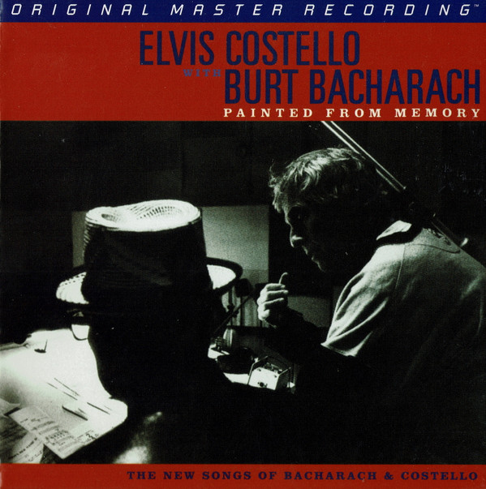

# Painted From Memory

By Elvis Costello

## Album Data

- Catalog #: Roon
- Format: Digital, Album

## Track listing

1. In the Darkest Place
2. Toledo
3. I Still Have That Other Girl
4. This House Is Empty Now
5. Tears at the Birthday Party
6. Such Unlikely Lovers
7. My Thief
8. The Long Division
9. Painted from Memory
10. The Sweetest Punch
11. What's Her Name Today?
12. God Give Me Strength

## See also

- [Armed Forces (Remastered 2020)](Armed_Forces_Remastered_2020.md)
- [Blood And Chocolate](Blood_And_Chocolate.md)
- [Costello](Costello-_My_Flame_Burns_Blue.md)
- [Imperial Bedroom](Imperial_Bedroom.md)
- [King Of America](King_Of_America.md)
- [Momofuku (Album Version)](Momofuku_Album_Version.md)
- [My Aim Is True](My_Aim_Is_True.md)
- [Secret, Profane and Sugarcane (Album Version)](Secret__Profane_and_Sugarcane_Album_Version.md)
- [Spanish Model](Spanish_Model.md)
- [This Year's Model](This_Years_Model.md)
- [Trust](Trust.md)
- [Beets: Momofuku](../../Beets/Elvis_Costello/Momofuku.md)
- [Beets: Secret, Profane & Sugarcane](../../Beets/Elvis_Costello/Secret__Profane_and_Sugarcane.md)
- [Beets: When I Was Cruel](../../Beets/Elvis_Costello/When_I_Was_Cruel.md)
- [Vinyl: ](../../Vinyl/Elvis_Costello/Elvis_Costello.md)
- [Vinyl: Taking Liberties](../../Vinyl/Elvis_Costello/Taking_Liberties.md)
