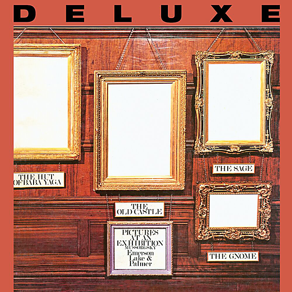

# Pictures At An Exhibition (Live)

By Emerson, Lake & Palmer

## Album Data

- Catalog #: Roon
- Format: Digital, Album

## Track listing

1. Pictures at an Exhibition (Kartinki s vïstavski), for orchestra, orchestrations other than Ravel's: Promenade
2. Pictures at an Exhibition (Kartinki s vïstavski), for orchestra, orchestrations other than Ravel's: The Gnome
3. Pictures at an Exhibition (Kartinki s vïstavski), for orchestra, orchestrations other than Ravel's: Promenade
4. The Sage
5. Pictures at an Exhibition (Kartinki s vïstavski), for orchestra, orchestrations other than Ravel's: The Old Castle
6. Blues Variations
7. Pictures at an Exhibition (Kartinki s vïstavski), for orchestra, orchestrations other than Ravel's: Promenade
8. Pictures at an Exhibition (Kartinki s vïstavski), for orchestra, orchestrations other than Ravel's: The Hut Of Baba Yaga
9. The Curse Of Baba Yaga (after Mussorgsky)
10. Pictures at an Exhibition (Kartinki s vïstavski), for orchestra, orchestrations other than Ravel's: The Hut Of Baba Yaga
11. Pictures at an Exhibition (Kartinki s vïstavski), for orchestra, orchestrations other than Ravel's: The Great Gates Of Kiev
12. Nutrocker (after Tchaikovsky)

