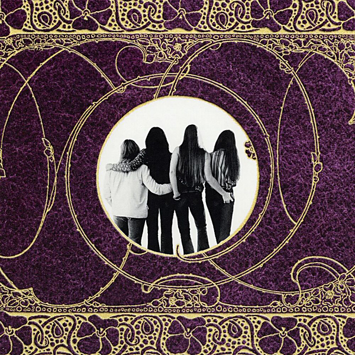

# First Time In A Long Time: The Reprise Recordings

By Fanny

## Album Data

- Catalog #: Roon
- Format: Digital, Album

## Track listing

1-1 Come and Hold Me
1-2 I Just Realized
1-3 Candlelighter Man
1-4 Conversation With a Cop
1-5 Badge [LP Version]
1-6 Changing Horses
1-7 Bitter Wine
1-8 Take a Message to the Captain
1-9 It Takes a Lot of Good Lovin' [LP Version]
1-10 Shade Me
1-11 Seven Roads [First Version]
1-12 Charity Ball [First Version]
1-13 Place in the Country [First Version]
1-14 Changes [LP Version]
1-15 One Step at a Time [LP Version]
1-16 Nowhere to Run [LP Version]
1-17 Seven Roads [Second Version]
1-18 Lady's Choice [LP Version]
1-19 New Day [LP Version]
1-20 I Find Myself [Wild Honey Demo Session]
1-21 Queen Aretha [Wild Honey Demo Session]
1-22 Flame Tree [Wild Honey Demo Session]
1-23 Fanny Reprise Records Promo One
1-24 Fanny Reprise Records Promo Two
1-25 Fanny Reprise Records Promo Three
2-1 Charity Ball [Second Version]
2-2 What Kind of Lover
2-3 Cat Fever
2-4 A Person Like You
2-5 Special Care
2-6 What's Wrong With Me?
2-7 Soul Child
2-8 You're the One
2-9 Thinking of You
2-10 Place in the Country [Second Version]
2-11 A Little While Later
2-12 Charity Ball [Single Version]
2-13 True Blue [The Kitchen Tapes]
2-14 Candlelighter Man [The Kitchen Tapes]
2-15 Summer Song [The Kitchen Tapes]
2-16 Tomorrow
2-17 Rock Bottom Blues [Backing Track] [Fanny Hill Sessions]
2-18 Ain't That Peculiar
2-19 Knock on My Door
2-20 Blind Alley
2-21 You've Got a Home
2-22 Wonderful Feeling
2-23 Borrowed Time
3-1 Hey Bulldog
3-2 Think About the Children
3-3 Rock Bottom Blues
3-4 Sound and the Fury
3-5 The First Time
3-6 Rock Bottom Blues [Original Vocal]
3-7 Wonderful Feeling [Single Version]
3-8 Young and Dumb
3-9 Hey Bulldog [Live at the Bijou Café, Philadelphia, PA, 4/21/1973]
3-10 Summer Song [Live at the Bijou Café, Philadelphia, PA, 4/21/1973]
3-11 It Takes a Lot of Good Lovin' [Live at the Bijou Café, Philadelphia, PA, 4/21/1973]
3-12 Badge [Live at the Bijou Café, Philadelphia, PA, 4/21/1973]
3-13 Young and Dumb [Live at the Bijou Café, Philadelphia, PA, 4/21/1973]
3-14 Last Night I Had a Dream [Live at the Bijou Café, Philadelphia, PA, 4/21/1973]
3-15 Ain't That Peculiar [Live at the Bijou Café, Philadelphia, PA, 4/21/1973]
3-16 Borrowed Time [Live in Cleveland, OH, 4/11/1972]
3-17 Place in the Country [Live in Cleveland, OH, 4/11/1972]
3-18 Knock on My Door [Live in Cleveland, OH, 4/11/1972]
3-19 Charity Ball [Live in Cleveland, OH, 4/11/1972]
4-1 Lonesome Pine [Mother's Pride Demo Session]
4-2 Beside Myself [Mother's Pride Demo Session]
4-3 I'll Never Be The Same [Mother's Pride Demo Session]
4-4 All Mine [Mother's Pride Demo Session]
4-5 Old Milwaukee [Mother's Pride Demo Session]
4-6 Long Road Home [Mother's Pride Demo Session]
4-7 Back in My Arms Again
4-8 No Deposit, No Return
4-9 Last Night I Had a Dream
4-10 Long Road Home
4-11 Old Hat
4-12 Solid Gold
4-13 Is Otvreally You?
4-14 All Mine
4-15 Summer Song
4-16 Polecat Blues
4-17 Beside Myself
4-18 Regular Guy
4-19 I Need You Need Me
4-20 Feelings
4-21 I'm Satisfied
4-22 Fanny Reprise Records Promo Four
4-23 'Till Then [Mother's Pride Demo Session]

