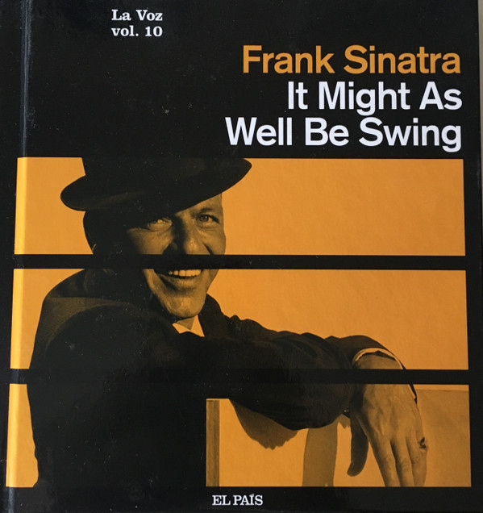

# It Might As Well Be Swing

By Frank Sinatra

## Album Data

- Catalog #: Roon
- Format: Digital, Album

## Track listing

1. Fly Me To The Moon (In Other Words)
2. I Wish You Love
3. I Believe In You [From the Broadway Show "How To Succeed In Business Without Really Trying"]
4. More (Theme From "Mondo Cane")
5. I Can't Stop Loving You
6. Hello, Dolly! [From the Broadway Show "Hello, Dolly!"]
7. I Wanna Be Around
8. The Best Is Yet to Come
9. The Good Life
10. Wives and Lovers

## See also

- [In The Wee Small Hours](In_The_Wee_Small_Hours.md)
- [Sinatra At The Sands (Live At The Sands Hotel And Casino/1966)](Sinatra_At_The_Sands_Live_At_The_Sands_Hotel_And_Casino-1966.md)
- [Beets: I'm In The Mood For Love - 25 Songs For Lovers](../../Beets/Frank_Sinatra/Im_In_The_Mood_For_Love_-_25_Songs_For_Lovers.md)
- [Beets: In the Wee Small Hours](../../Beets/Frank_Sinatra/In_the_Wee_Small_Hours.md)
- [Beets: My Way](../../Beets/Frank_Sinatra/My_Way.md)
- [Beets: Sinatra 80th](../../Beets/Frank_Sinatra/Sinatra_80th.md)
- [Vinyl: ](../../Vinyl/Frank_Sinatra/Frank_Sinatra.md)
- [Vinyl: In The Wee Small Hours](../../Vinyl/Frank_Sinatra/In_The_Wee_Small_Hours.md)
- [Vinyl: Learnin' The Blues / If I Had Three Wishes](../../Vinyl/Frank_Sinatra/Learnin_The_Blues_-_If_I_Had_Three_Wishes.md)
- [Vinyl: Love And Marriage / The Impatient Years](../../Vinyl/Frank_Sinatra/Love_And_Marriage_-_The_Impatient_Years.md)
