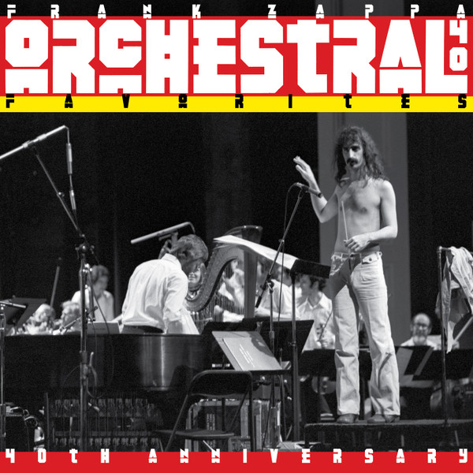

# Orchestral Favorites (40th Anniversary)

By Frank Zappa

## Album Data

- Catalog #: Roon
- Format: Digital, Album

## Track listing

1-1 Strictly Genteel
1-2 Pedro's Dowry
1-3 Naval Aviation in Art?
1-4 Duke of Prunes
1-5 Bogus Pomp
1-6 Strictly Genteel [Keyboard OD Version]
2-1 Show Star/Bogus Pomp Explained
2-2 Bogus Pomp (live at Royce Hall, 9/18/1975)
2-3 Revised Music for Low-Budget Symphony Orchestra
2-4 The Story of Pedro's Dowry (live at Royce Hall, 9/18/1975)
2-5 Pedro's Dowry (live at Royce Hall, 9/18/1975)
2-6 The Story of Rollo (live at Royce Hall, 9/18/1975)
2-7 Rollo (live at Royce Hall, 9/18/1975)
3-1 Black Napkins Instructions (live at Royce Hall, 9/18/1975)
3-2 Black Napkins (live at Royce Hall, 9/18/1975)
3-3 Dog/Meat
3-4 The Players (live at Royce Hall, 9/18/1975)
3-5 Naval Aviation in Art? (live at Royce Hall, 9/18/1975)
3-6 "Another Weirdo Number"
3-7 Lumpy Gravy (Extract)/Improvisation
3-8 Evening at the Hermitage (live at Royce Hall, 9/18/1975)
3-9 A Special Guest Artist (live at Royce Hall, 9/18/1975)
3-10 Duke of Prunes (live at Royce Hall, 9/18/1975)
3-11 Absolutely Disgusting (live at Royce Hall, 9/18/1975)
3-12 The Adventures of Greggery Peccary (live at Royce Hall, 9/18/1975)
3-13 Strictly Genteel (live at Royce Hall, 9/18/1975)

