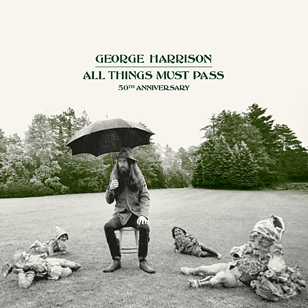

# All Things Must Pass (50th Anniversary / Super Deluxe)

By George Harrison

## Album Data

- Catalog #: Roon
- Format: Digital, Album

## Track listing

1-1 I'd Have You Anytime (2020 mix)
1-2 My Sweet Lord (2020 mix)
1-3 Wah-Wah
1-4 Isn't It a Pity [Version One]
1-5 What Is Life (2020 mix)
1-6 If Not for You (2020 mix)
1-7 Behind That Locked Door (2020 mix)
1-8 Let It Down (2020 mix)
1-9 Run of the Mill (2020 mix)
2-1 Beware of Darkness (2020 mix)
2-2 Apple Scruffs (2020 mix)
2-3 Ballad of Sir Frankie Crisp (Let It Roll) (2020 mix)
2-4 Awaiting on You All (2020 mix)
2-5 All Things Must Pass (2020 mix)
2-6 I Dig Love (2020 mix)
2-7 Art of Dying (2020 mix)
2-8 Isn't It a Pity?
2-9 Hear Me Lord (2020 mix)
2-10 Out of the Blue
2-11 It's Johnny's Birthday
2-12 Plug Me In
2-13 I Remember Jeep
2-14 Thanks for the Pepperoni
3-1 All Things Must Pass [Take 1]
3-2 Behind That Locked Door [Take 2]
3-3 I Live For You [Take 1]
3-4 Apple Scruffs [Take 1]
3-5 What Is Life (take 3)
3-6 Awaiting On You All [Take 1]
3-7 Isn't It A Pity [Take 2]
3-8 I'd Have You Anytime [Take 1]
3-9 I Dig Love [Take 1]
3-10 Going Down to Golders Green [Take 1]
3-11 Dehra Dun [Take 2]
3-12 Om Hare Om (Gopala Krishna) [Take 1]
3-13 Ballad Of Sir Frankie Crisp (Let It Roll) [Take 2]
3-14 My Sweet Lord [Take 1]
3-15 Sour Milk Sea [Take 1]
4-1 Run Of The Mill [Take 1]
4-2 Art of Dying (take 1)
4-3 Everybody/Nobody [Take l]
4-4 Wah-Wah
4-5 Window Window [Take 1]
4-6 Beautiful Girl [Take 1]
4-7 Beware of Darkness [Take 1]
4-8 Let it Down [Take 1]
4-9 Tell Me What Has Happened to You (take 1)
4-10 Hear Me Lord [Take 1]
4-11 Nowhere to Go [Take 1]
4-12 Cosmic Empire [Take 1]
4-13 Mother Divine [Take 1]
4-14 I Don't Want to Do It [Take 1]
4-15 If Not for You [Take 1]
5-1 Isn't It Pity
5-2 Wah-Wah [Take 1-28 May]
5-3 I'd Have You Anytime [Take 5-28 May]
5-4 Art of Dying [Take 1-29 May]
5-5 Isn't It a Pity [Take 27 - 3 June]
5-6 If Not for You [2-4 June]
5-7 Wedding Bells (Are Breaking Up That Old Gang Of Mine) [Take 1-9 June]
5-8 What Is Life (Take 1-22 June)
5-9 Beware of Darkness (Take 8-23 June)
5-10 Hear Me Lord [Take 5-24 June]
5-11 Let It Down [Take 1-24 June]
5-12 Run of the Mill [Take 36 -30 June]
5-13 Down to the River (Rocking Chair Jam) [Take 1-30 June]
5-14 Get Back [Take 1-1 July]
5-15 Almost 12 Bar Honky Tonk [Take 1-3 July]
5-16 It's Johnny's Birthday [Take 1-7 October]
5-17 Woman Don't You Cry for Me [Take 5-7 October]

