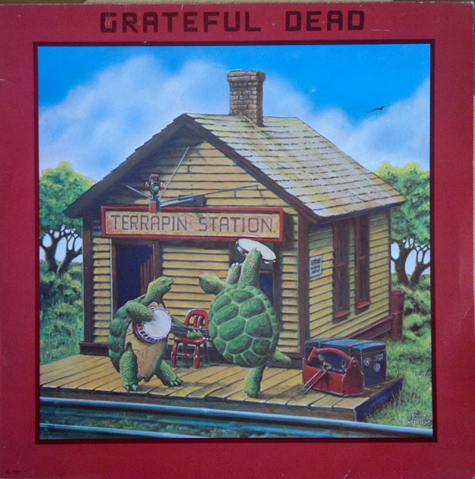

# Terrapin Station

By Grateful Dead

## Album Data

- Catalog #: Roon
- Format: Digital, Album

## Track listing

1. Estimated Prophet
2. Dancing in the Streets
3. Passenger
4. Samson & Delilah
5. Sunrise
6. Terrapin Station

## See also

- [American Beauty (Édition Studio Masters)](American_Beauty_Édition_Studio_Masters.md)
- [Dick's Picks Vol. 12](Dicks_Picks_Vol_12-_Providence_Civic_Center__Providence__RI_6-26-74_-_Boston_Garden__Boston__MA_6-28-74_Live.md)
- [Live / Dead](Live_-_Dead.md)
- [The Best of the Grateful Dead](The_Best_of_the_Grateful_Dead.md)
- [Workingman's Dead (Edition Studio Masters)](Workingmans_Dead_Edition_Studio_Masters.md)
- [Beets: 1974-05-21 - Edmundson Pavilion, U of Washington](../../Beets/Grateful_Dead/1974-05-21_-_Edmundson_Pavilion__U_of_Washington.md)
- [Beets: American Beauty](../../Beets/Grateful_Dead/American_Beauty.md)
- [Beets: Terrapin Station](../../Beets/Grateful_Dead/Terrapin_Station.md)
