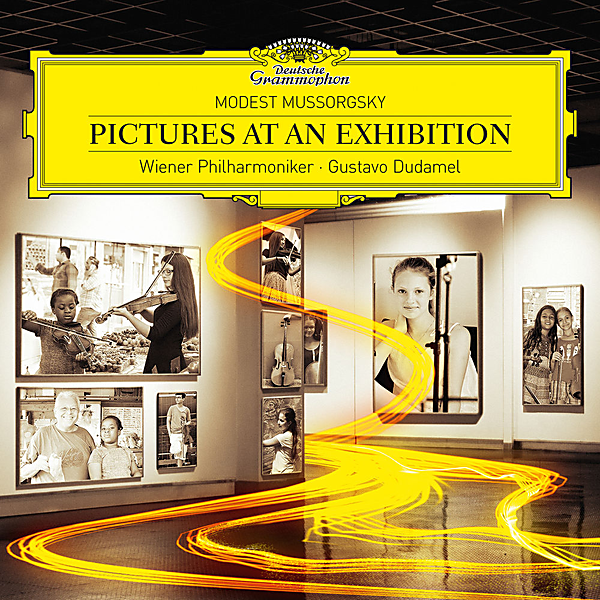

# Mussorgsky : Pictures at an Exhibition

By Gustavo Dudamel

## Album Data

- Catalog #: Roon
- Format: Digital, Album

## Track listing

1. Pictures At An Exhibition: Promenade I
2. Pictures At An Exhibition: Gnomus
3. Pictures At An Exhibition: Promenade II
4. Pictures At An Exhibition: The Old Castle
5. Pictures At An Exhibition: Promenade III
6. Pictures At An Exhibition: Tuileries Gardens
7. Pictures At An Exhibition: Bydlo
8. Pictures At An Exhibition: Promenade IV
9. Pictures At An Exhibition: Ballet Of The Unhatched Chicks
10. Pictures At An Exhibition: Samuel Goldenberg und Schmuÿle
11. Pictures At An Exhibition: The Market At Limoges
12. Pictures At An Exhibition: Catacombae (Sepulchrum Romanum)
13. Pictures At An Exhibition: Cum Mortuis In Lingua Mortua
14. Pictures At An Exhibition: The Hut On Chicken's Legs
15. Pictures At An Exhibition: The Great Gate Of Kiev
16. Night On Bald Mountain
17. Swan Lake Suite, Op.20a: 2. Waltz

## See also

- [Rachmaninov](Rachmaninov_-_Piano_Concerto_No3_In_D_Minor__Op30_-_Prokofiev_-_Piano_Concerto_No2_In_G_Minor__Op16_96_kHz_-_24_Bit_-_Live_From_Caracas_-_2013.md)
- [R. Strauss](R_Strauss_-_Also_sprach_Zarathustra.md)
- [West Side Story (Original Motion Picture Soundtrack)](West_Side_Story_Original_Motion_Picture_Soundtrack.md)
