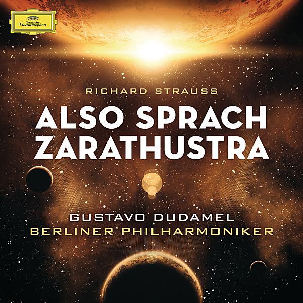

# R. Strauss : Also sprach Zarathustra

By Gustavo Dudamel

## Album Data

- Catalog #: Roon
- Format: Digital, Album

## Track listing

1. Also Sprach Zarathustra, op. 30: Einleitung
2. Also Sprach Zarathustra, op. 30: Von den hinterweltlern
3. Also Sprach Zarathustra, op. 30: Von der grossen sehnsucht
4. Also Sprach Zarathustra, op. 30: Von den freuden und leidenschaften
5. Also Sprach Zarathustra, op. 30: Das grablied
6. Also Sprach Zarathustra, op. 30: Von der wissenschaft
7. Also Sprach Zarathustra, op. 30: Der genesende
8. Also Sprach Zarathustra, op. 30: Das tanzlied
9. Also Sprach Zarathustra, op. 30: Nachtwandlerlied
10. Til eulenspiegels lustige streiche, op. 28
11. Don Juan, op. 20

## See also

- [Mussorgsky](Mussorgsky_-_Pictures_at_an_Exhibition.md)
- [Rachmaninov](Rachmaninov_-_Piano_Concerto_No3_In_D_Minor__Op30_-_Prokofiev_-_Piano_Concerto_No2_In_G_Minor__Op16_96_kHz_-_24_Bit_-_Live_From_Caracas_-_2013.md)
- [West Side Story (Original Motion Picture Soundtrack)](West_Side_Story_Original_Motion_Picture_Soundtrack.md)
