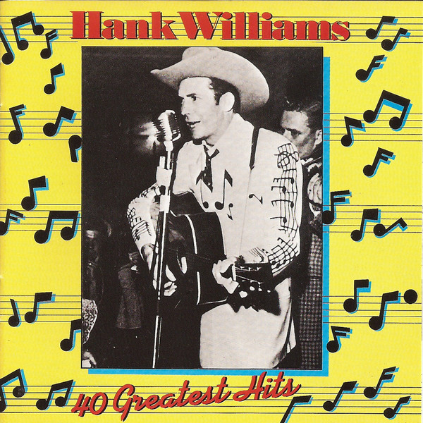

# 40 Greatest Hits

By Hank Williams

## Album Data

- Catalog #: Roon
- Format: Digital, Album

## Track listing

1-1 Move It on Over
1-2 A Mansion on the Hill
1-3 Lovesick Blues
1-4 Wedding Bells
1-5 Mind Your Own Business
1-6 You're Gonna Change (or I'm Gonna Leave)
1-7 Lost Highway
1-8 My Bucket's Got a Hole in It
1-9 I'm So Lonesome I Could Cry
1-10 I Just Don't Like This Kind of Livin'
1-11 Long Gone Lonesome Blues
1-12 My Son Calls Another Man Daddy
1-13 Why Don't You Love Me (Like You Used to Do)?
1-14 Why Should We Try Anymore
1-15 They'll Never Take Her Love from Me
1-16 Moanin' the Blues
1-17 Nobody's Lonesome for Me
1-18 Cold, Cold Heart
1-19 Dear John
1-20 Howlin' at the Moon
2-1 I Can't Help It (If I'm Still in Love With You)
2-2 Hey, Good Lookin'
2-3 Crazy Heart
2-4 (I Heard That) Lonesome Whistle
2-5 Baby, We're Really in Love
2-6 Ramblin' Man
2-7 Honky Tonk Blues
2-8 I'm Sorry for You, My Friend
2-9 Half as Much
2-10 Jambalaya (On the Bayou)
2-11 Window Shopping
2-12 Settin' the Woods on Fire
2-13 You Win Again
2-14 I'll Never Get Out of This World Alive
2-15 Kaw-Liga
2-16 Your Cheatin' Heart
2-17 Take These Chains from My Heart
2-18 I Won't Be Home No More
2-19 Weary Blues From Waitin' (Dubbed)
2-20 I Saw The Light [Single Version]

