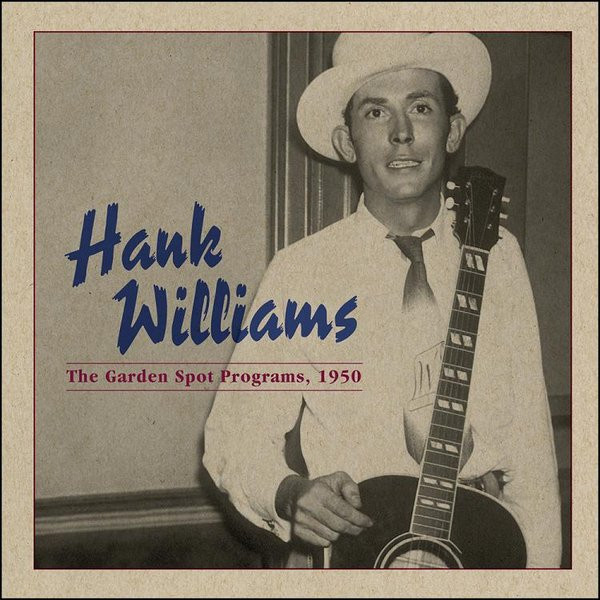

# The Garden Spot Programs, 1950

By Hank Williams

## Album Data

- Catalog #: Roon
- Format: Digital, Album

## Track listing

1. The Garden Spot Jingle
2. Lovesick Blues
3. A Mansion on the Hill
4. Fiddle Tune
5. I've Just Told Mama Goodbye
6. Closing/Oh! Susanna
7. The Garden Spot Jingle
8. Mind Your Own Business
9. Lovesick Blues
10. Fiddle Tune
11. At the First Fall of Snow
12. Closing/Oh! Susanna
13. The Garden Spot Jingle
14. I Can't Get You Off of My Mind
15. I Don't Care (If Tomorrow Never Comes)
16. Fiddle Tune
17. Farther Along
18. Closing/Oh! Susanna
19. The Garden Spot Jingle
20. I'll Be a Bachelor 'til I Die
21. Wedding Bells
22. Fiddle Tune
23. Jesus Remembered Me
24. Closing/Oh! Susanna

