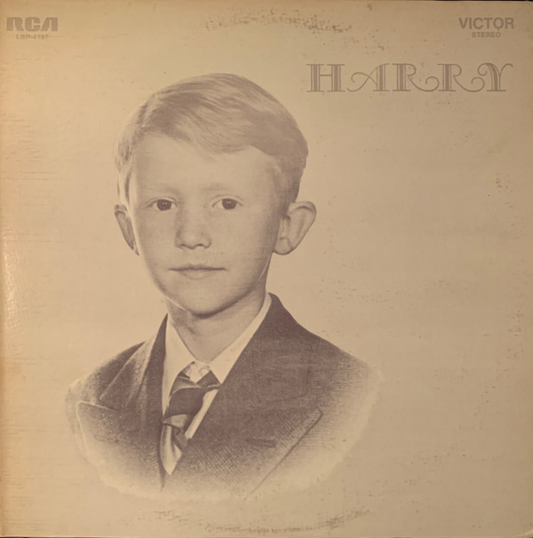

# Harry

By Harry Nilsson

## Album Data

- Catalog #: Roon
- Format: Digital, Album

## Track listing

1-1 The Puppy Song
1-2 Nobody Cares About The Railroads Anymore
1-3 Open Your Window
1-4 Mother Nature's Son
1-5 Fairfax Rag
1-6 City Life
1-7 Mournin' Glory Story
1-8 Maybe
1-9 Marchin' Down Broadway
1-10 I Guess The Lord Must Be In New York City
1-11 Rainmaker
1-12 Mr. Bojangles
1-13 Simon Smith And His Amazing Dancing Bear
1-14 I Will Take You There [single mix]
1-15 Waiting [from the motion picture JENNY]
1-16 Rainmaker [single mix]
1-17 Mourning Glory [single mix]
1-18 Garbage Can Ballet [alternate version]
1-19 HARRY radio spot
1-20 Voices Of Vista radio spots [June 1969]
2-1 You Are Here
2-2 The Cast And Crew [from the motion picture SKIDOO]
2-3 Garbage Can Ballet [from the motion picture SKIDOO]
2-4 I Will Take You There [from the motion picture SKIDOO]
2-5 Girlfriend
2-6 Wasting My Time [alternate mix]
2-7 Rainmaker [alternate version]
2-8 Open Your Window [alternate take]
2-9 Postcard
2-10 Think About Your Troubles [alternate version]
2-11 Marry Me A Little
2-12 Ballin' The Jack [1970 version]
2-13 Gotta Get Up [1970 demo]
2-14 Down To The Valley [single mix]
2-15 Buy My Album [single mix]
2-16 Joy [alternate version]
2-17 Blackbird
2-18 Paradise
2-19 Lucille
2-20 Early In The Morning [alternate version]

## Track listing

1-1 The Puppy Song
1-2 Nobody Cares About The Railroads Anymore
1-3 Open Your Window
1-4 Mother Nature's Son
1-5 Fairfax Rag
1-6 City Life
1-7 Mournin' Glory Story
1-8 Maybe
1-9 Marchin' Down Broadway
1-10 I Guess The Lord Must Be In New York City
1-11 Rainmaker
1-12 Mr. Bojangles
1-13 Simon Smith And His Amazing Dancing Bear
1-14 I Will Take You There [single mix]
1-15 Waiting [from the motion picture JENNY]
1-16 Rainmaker [single mix]
1-17 Mourning Glory [single mix]
1-18 Garbage Can Ballet [alternate version]
1-19 HARRY radio spot
1-20 Voices Of Vista radio spots [June 1969]
2-1 You Are Here
2-2 The Cast And Crew [from the motion picture SKIDOO]
2-3 Garbage Can Ballet [from the motion picture SKIDOO]
2-4 I Will Take You There [from the motion picture SKIDOO]
2-5 Girlfriend
2-6 Wasting My Time [alternate mix]
2-7 Rainmaker [alternate version]
2-8 Open Your Window [alternate take]
2-9 Postcard
2-10 Think About Your Troubles [alternate version]
2-11 Marry Me A Little
2-12 Ballin' The Jack [1970 version]
2-13 Gotta Get Up [1970 demo]
2-14 Down To The Valley [single mix]
2-15 Buy My Album [single mix]
2-16 Joy [alternate version]
2-17 Blackbird
2-18 Paradise
2-19 Lucille
2-20 Early In The Morning [alternate version]

