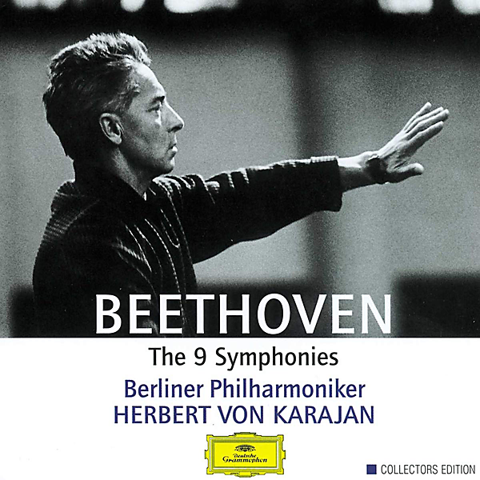

# Beethoven : 9 Symphonies (1963)

By Herbert von Karajan

## Album Data

- Catalog #: Roon
- Format: Digital, Album

## Track listing

1-1 Symphony No. 1 in C major Op. 21: 1. Adagio molto - Allegro con brio
1-2 Symphony No. 1 in C major Op. 21: 2. Andante cantabile con moto
1-3 Symphony No. 1 in C major Op. 21: 3. Menuetto. Allegro molto e vivace
1-4 Symphony No. 1 in C major Op. 21: 4. Adagio - Allegro molto e vivace
1-5 Symphony No. 2 in D major Op. 36: 1. Adagio - Allegro con brio
1-6 Symphony No. 2 in D major Op. 36: 2. Larghetto
1-7 Symphony No. 2 in D major Op. 36: 3. Scherzo. Allegro
1-8 Symphony No. 2 in D major Op. 36: 4. Allegro molto
2-1 Symphony No. 3 in E flat major ("Eroica"), Op. 55: 1. Allegro con brio
2-2 Symphony No. 3 in E flat major ("Eroica"), Op. 55: 2. Marcia funebre. Adagio assai
2-3 Symphony No. 3 in E flat major ("Eroica"), Op. 55: 3. Scherzo. Allegro vivace
2-4 Symphony No. 3 in E flat major ("Eroica"), Op. 55: 4. Finale. Allegro molto
2-5 Symphony No. 4 in B flat major, Op. 60: 1. Adagio - Allegro vivace
2-6 Symphony No. 4 in B flat major, Op. 60: 2. Adagio
2-7 Symphony No. 4 in B flat major, Op. 60: 3. Allegro vivace
2-8 Symphony No. 4 in B flat major, Op. 60: 4. Allegro ma non troppo
3-1 Symphony No. 5 in C minor ("Fate"), Op. 67: 1. Allegro con brio
3-2 Symphony No. 5 in C minor ("Fate"), Op. 67: 2. Andante con moto
3-3 Symphony No. 5 in C minor ("Fate"), Op. 67: 3. Allegro
3-4 Symphony No. 5 in C minor ("Fate"), Op. 67: 4. Allegro
3-5 Symphony No. 6 in F major ("Pastoral"), Op. 68: 1. Erwachen heiterer Empfindungen bei der Ankunft auf dem Lande (Awakening of Cheerful Feelings upo
3-6 Symphony No. 6 in F major ("Pastoral"), Op. 68: 2. Szene am Bach (Scene by the Brook). Andante molto moto
3-7 Symphony No. 6 in F major ("Pastoral"), Op. 68: 3. Lustiges Zusammensein der Landleute (Merry Gathering of Country Folk). Allegro
3-8 Symphony No. 6 in F major ("Pastoral"), Op. 68: 4. Gewitter, Sturm (Thunderstorm). Allegro
3-9 Symphony No. 6 in F major ("Pastoral"), Op. 68: 5. Hirtengesang. Frohe und dankbare Gefühle nach dem Sturm (Shepherd's Song: Happy and Thankful Fee
4-1 Symphony No. 7 in A major, Op. 92: 1. Poco sostenuto - Vivace
4-2 Symphony No. 7 in A major, Op. 92: 2. Allegretto scherzando
4-3 Symphony No. 7 in A major, Op. 92: 3. Tempo di Menuetto
4-4 Symphony No. 7 in A major, Op. 92: 4. Allegro vivace
4-5 Symphony No. 8 in F major, Op. 93: 1. Allegro vivace a con brio
4-6 Symphony No. 8 in F major, Op. 93: 2. Allegretto scherzando
4-7 Symphony No. 8 in F major, Op. 93: 3. Tempo di Menuetto
4-8 Symphony No. 8 in F major, Op. 93: 4. Allegro vivace
5-1 Symphony No. 9 in D minor ("Choral"), Op. 125: 1. Allegro ma non troppo, un poco maestoso
5-2 Symphony No. 9 in D minor ("Choral"), Op. 125: 2. Molto vivace
5-3 Symphony No. 9 in D minor ("Choral"), Op. 125: 3. Adagio molto e cantabile
5-4 Symphony No. 9 in D minor ("Choral"), Op. 125: 4. Presto - Allegro assai
5-5 Symphony No. 9 in D minor ("Choral"), Op. 125: 5. Presto - "O Freunde, nicht diese Töne!" - Allegro assai - Allegro assai vivace. Alla marcia - An

