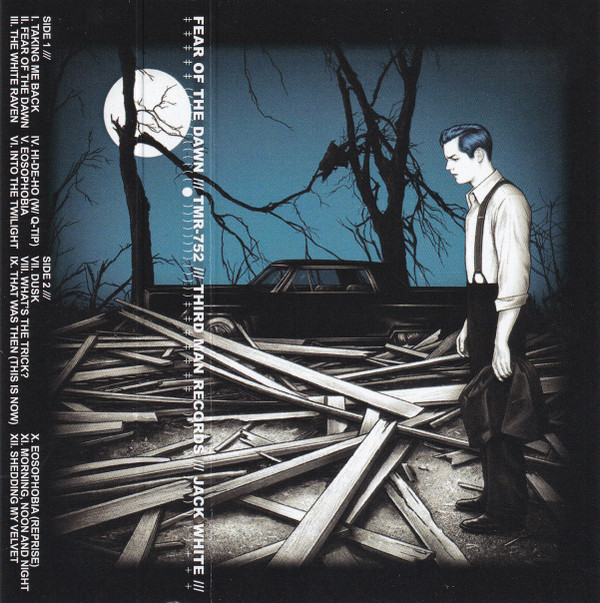

# Fear Of The Dawn

By Jack White

## Album Data

- Catalog #: Roon
- Format: Digital, Album

## Track listing

1. Taking Me Back
2. Fear of the Dawn
3. The White Raven
4. Hi-De-Ho
5. Eosophobia
6. Into the Twilight
7. Dusk
8. What's the Trick?
9. That Was Then, This Is Now
10. Eosophobia (reprise)
11. Morning, Noon and Night
12. Shedding My Velvet

## See also

- [Blunderbuss](Blunderbuss.md)
- [Jack White Acoustic Recordings 1998 - 2016](Jack_White_Acoustic_Recordings_1998_-_2016.md)
- [Lazaretto](Lazaretto.md)
- [Beets: Acoustic Recordings 1998–2016](../../Beets/Jack_White/Acoustic_Recordings_1998–2016.md)
- [Beets: Blunderbuss](../../Beets/Jack_White/Blunderbuss.md)
- [Beets: Bonnaroo 2014](../../Beets/Jack_White/Bonnaroo_2014.md)
- [Beets: Lazaretto](../../Beets/Jack_White/Lazaretto.md)
- [CD: Blunderbuss](../../CD/Jack_White/Blunderbuss.md)
- [CD: ](../../CD/Jack_White/Jack_White.md)
- [Vinyl: Acoustic Recordings 1998-2016](../../Vinyl/Jack_White/Acoustic_Recordings_1998-2016.md)
- [Vinyl: ](../../Vinyl/Jack_White/Jack_White.md)
- [Vinyl: Lazaretto](../../Vinyl/Jack_White/Lazaretto.md)
