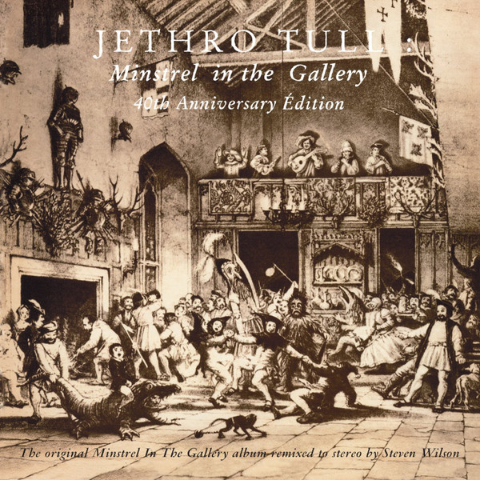

# Minstrel in the Gallery (40th Anniversary Edition)

By Jethro Tull

## Album Data

- Catalog #: Roon
- Format: Digital, Album

## Track listing

1-1 Minstrel in the Gallery (2015 remix)
1-2 Cold Wind to Valhalla (2015 remix)
1-3 Black Satin Dancer (2015 remix)
1-4 Requiem (2015 remix)
1-5 One White Duck / 010 = Nothing at All
1-6 Baker St. Muse: Baker St. Muse (2015 remix)
1-7 Pig-Me and the Whore
1-8 Nice Little Tune
1-9 Crash-Barrier Waltzer
1-10 Mother England Reverie
1-11 Grace (2015 remix)
1-12 Summerday Sands (2015 remix)
1-13 Requiem [Early Version]
1-14 One White Duck [Take 5]
1-15 Grace [Take 2]
1-16 Minstrel In the Gallery (BBC version)
1-17 Cold Wind To Valhalla (BBC version)
1-18 Aqualung [16-18 'BBC' Versions]
2-1 Introduction (The Beach, Pt. 2)
2-2 Wind Up (Palais Des Sports, Paris, 5th July 1975)
2-3 Critique Oblique (Palais Des Sports, Paris, 5th July 1975)
2-4 Wond'ring Aloud (Palais Des Sports, Paris, 5th July 1975)
2-5 My God: God Rest Ye Merry Gentlemen/Bourée/Quartet/Living In The Past/My God (Reprise)
2-6 Cross-Eyed Mary (Palais Des Sports, Paris, 5th July 1975)
2-7 Minstrel in the Gallery (Palais Des Sports, Paris, 5th July 1975)
2-8 Skating Away On the Thin Ice of the New Day
2-9 Bungle in the Jungle (Palais des Sports, Paris, 5th July 1975)
2-10 Aqualung (Palais Des Sports, Paris, 5th July 1975)
2-11 Guitar Improvisation (Palais Des Sports, Paris, 5th July 1975)
2-12 Back-Door Angels (Palais Des Sports, Paris, 5th July 1975)
2-13 Locomotive Breath: Hard Headed English General/Back-Door Angels (Reprise) [With Improvisations]

