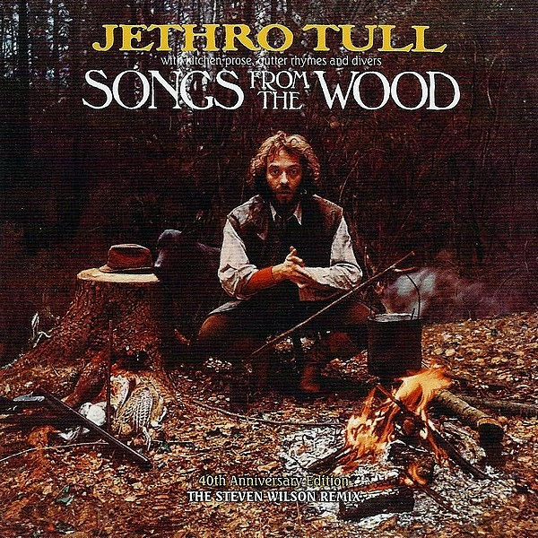

# Songs from the Wood (40th Anniversary Edition; The Steven Wilson Remix)

By Jethro Tull

## Album Data

- Catalog #: Roon
- Format: Digital, Album

## Track listing

1. Songs From the Wood [A Steven Wilson Stereo Remix]
2. Jack-in-the-Green [A Steven Wilson Stereo Remix]
3. Cup of Wonder [A Steven Wilson Stereo Remix]
4. Hunting Girl [A Steven Wilson Stereo Remix]
5. Ring Out, Solstice Bells [A Steven Wilson Stereo Remix]
6. Velvet Green [A Steven Wilson Stereo Remix]
7. The Whistler [A Steven Wilson Stereo Remix]
8. Pibroch (Cap in Hand) (Steven Wilson remix)
9. Fire at Midnight (Steven Wilson remix)
10. Old Aces Die Hard (Steven Wilson remix)
11. Working John, Working Joe (Steven Wilson remix)
12. Magic Bells (Ring Out, Solstice Bells) (Steven Wilson remix)
13. Songs From the Wood [Unedited Master]
14. Fire at Midnight [Unedited Master]
15. One Brown Mouse [Early Version]
16. Strip Cartoon (Steven Wilson remix)
17. The Whistler [Original 1977 U.S. Stereo Single Mix]

