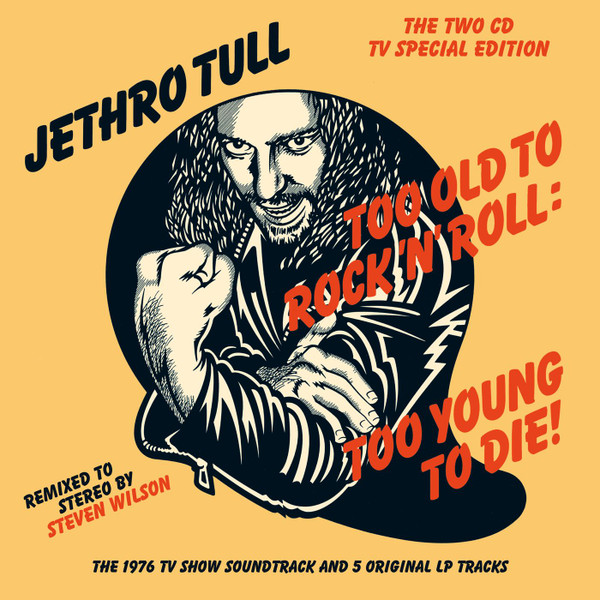

# Too Old to Rock 'n' Roll: Too Young to Die! (The TV Special Edition)

By Jethro Tull

## Album Data

- Catalog #: Roon
- Format: Digital, Album

## Track listing

1. Prelude (re‐recorded for the TV special)
2. Quiz Kid (re‐recorded for the TV special)
3. Crazed Institution (re‐recorded for the TV special)
4. Salamander (re‐recorded for the TV special)
5. Taxi Grab (re‐recorded for the TV special)
6. From a Dead Beat to an Old Greaser (re‐recorded for the TV special)
7. Bad Eyed and Loveless (re‐recorded for the TV special)
8. Big Dipper (re‐recorded for the TV special)
9. Too Old to Rock 'n' Roll: Too Young to Die! (re‐recorded for the TV special)
10. Pied Piper (re‐recorded for the TV special)
11. The Chequered Flag (Dead or Alive) (re‐recorded for the TV special)
12. From a Dead Beat to an Old Greaser [Monte Carlo January 1976]
13. Bad-Eyed and Loveless [Monte Carlo January 1976]
14. Big Dipper [Monte Carlo January 1976]
15. Too Old to Rock 'n' Roll: Too Young to Die! [Brussels November 1975]
16. The Chequered Flag (Dead or Alive) [Brussels November 1975]
17. Quiz Kid [Version 1]

