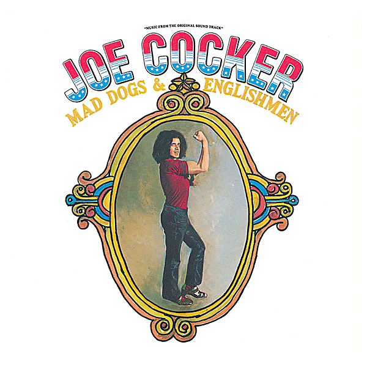

# Mad Dogs & Englishmen (Live At The Fillmore East/1970/Reissue)

By Joe Cocker

## Album Data

- Catalog #: Roon
- Format: Digital, Album

## Track listing

1. Introduction #1
2. Honky Tonk Women
3. Introduction #2
4. Sticks and Stones
5. Cry Me a River
6. Bird on the Wire
7. Feelin' Alright
8. Superstar
9. Introduction #3
10. Let's Go Get Stoned
11. Blue Medley: I'll Drown In My Own Tears/ When Something Is Wrong With My Baby/I've Been Loving You Too Long
12. Introduction #4
13. Girl From the North Country
14. Give Peace a Chance
15. Introduction #5
16. She Came In Thru the Bathroom Window
17. Space Captain
18. The Letter
19. Delta Lady

