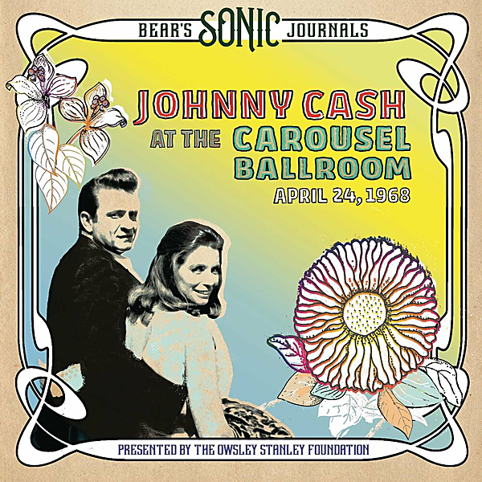

# Bear's Sonic Journals: Live At The Carousel Ballroom, April 24 1968

By Johnny Cash

## Album Data

- Catalog #: Roon
- Format: Digital, Album

## Track listing

1. Cocaine Blues
2. Long Black Veil
3. Orange Blossom Special
4. Going to Memphis
5. The Ballad of Ira Hayes
6. Rock Island Line
7. Guess Things Happen That Way
8. One Too Many Mornings
9. Don't Think Twice, It's All Right
10. Give My Love to Rose
11. Green, Green Grass of Home
12. Old Apache Squaw
13. Lorena
14. Forty Shades of Green
15. Bad News
16. Jackson
17. Tall Lover Man
18. June's Song Introduction
19. Wildwood Flower
20. Foggy Mountain Top
21. This Land Is Your Land
22. Wabash Cannonball
23. Worried Man Blues
24. Long Legged Guitar Pickin' Man
25. Ring of Fire
26. Big River
27. Don't Take Your Guns to Town
28. I Walk the Line

