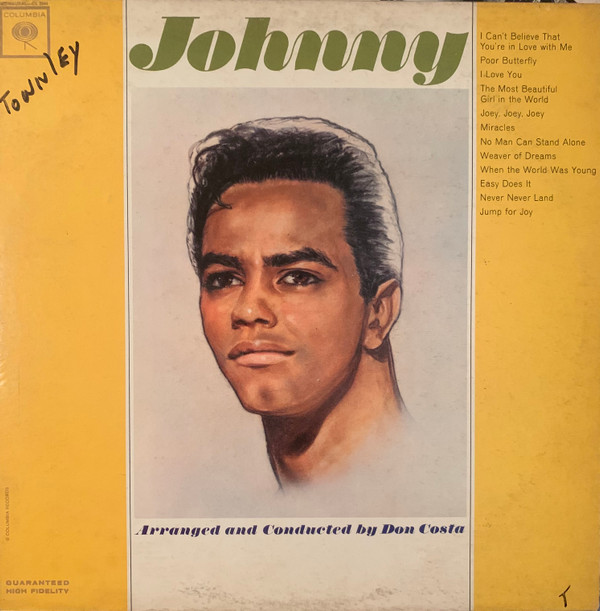

# Johnny

By Johnny Mathis

## Album Data

- Catalog #: Roon
- Format: Digital, Album

## Track listing

1. Easy Does It
2. The Most Beautiful Girl in the World (From Billy Rose's "Jumbo")
3. Miracles
4. When the World Was Young
5. Never Never Land (From the Musical Production "Peter Pan")
6. Poor Butterfly
7. Jump for Joy
8. Joey, Joey, Joey (excerpt From Act 1, Scene 11 of "The Most Happy Fella")
9. I Can't Believe That You're in Love With Me
10. I Love You (From "Mexican Hayride")
11. A Weaver of Dreams
12. No Man Can Stand Alone

