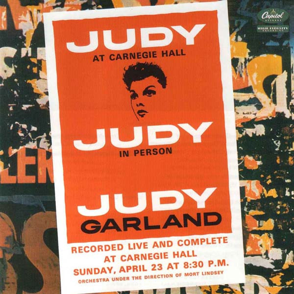

# Judy At Carnegie Hall

By Judy Garland

## Album Data

- Catalog #: Roon
- Format: Digital, Album

## Track listing

1-1 Overture: The Trolley Song/ Over the Rainbow/ The Man That Got Away
1-2 When You're Smiling (The Whole World Smiles with You)
1-3 Almost Like Being in Love/This Can't Be Love
1-4 Do It Again
1-5 You Go to My Head
1-6 Alone Together
1-7 Who Cares? (As long as You Care for Me)
1-8 Puttin' on the Ritz
1-9 How Long Has This Been Going On?
1-10 Just You, Just Me
1-11 The Man That Got Away
1-12 San Francisco
2-1 That's Entertainment!
2-2 I Can't Give You Anything But Love
2-3 Come Rain or Come Shine
2-4 You're Nearer
2-5 A Foggy Day
2-6 If Love Were All
2-7 Zing! Went the Strings of My Heart
2-8 Stormy Weather
2-9 You Made Me Love You/For Me and My Gal/The Trolley Song
2-10 Rock-A-Bye Your Baby With a Dixie Melody
2-11 Over the Rainbow
2-12 Swanee
2-13 After You've Gone
2-14 Chicago

