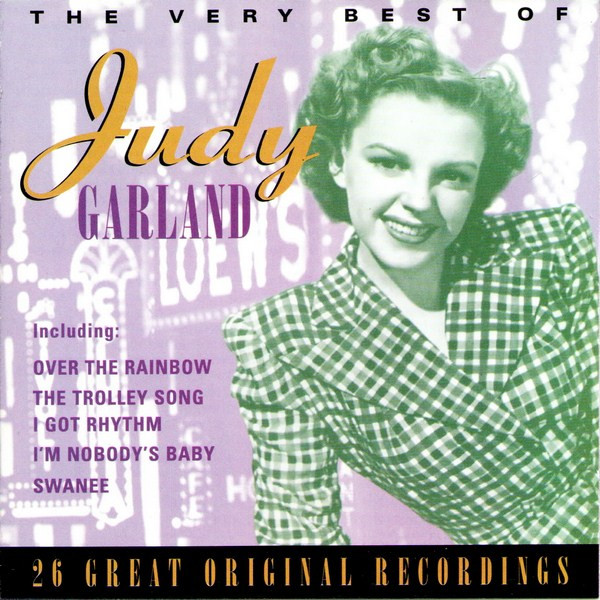

# The Very Best Of Judy Garland

By Judy Garland

## Album Data

- Catalog #: Roon
- Format: Digital, Album

## Track listing

1-1 Medley: This Is the Time of the Evening/While We're Young
1-2 Medley: You Made Me Love You/For Me and My Gal/The Boy Next Door/The Tr
1-3 A Pretty Girl Milking Her Cow
1-4 Carolina in the Morning
1-5 Rock-A-Bye Your Baby with a Dixie Melody
1-6 Danny Boy
1-7 Over the Rainbow
1-8 Come Rain or Come Shine
1-9 Just Imagine
1-10 I Feel a Song Coming On
1-11 Last Night When We Were Young
1-12 Life Is Just a Bowl of Cherries
1-13 April Showers
1-14 Maybe I'll Come Back
1-15 Dirty Hands, Dirty Face
1-16 Lucky Day
1-17 Memories of You
1-18 Any Place I Hang My Hat Is Home
1-19 By Myself
1-20 Little Girl Blue
1-21 Me and My Shadow
1-22 Among My Souvenirs
1-23 I Gotta Right to Sing the Blues
2-1 I Get the Blues When It Rains
2-2 Mean to Me
2-3 Then You've Never Been Blue
2-4 How About Me
2-5 Just a Memory
2-6 Blue Prelude
2-7 Happy New Year
2-8 It's So Lovely to Be Back in London
2-9 Zing! Went the Strings of My Heart
2-10 I Can't Give You Anything But Love
2-11 This Is It
2-12 More Than You Know
2-13 I Am Loved
2-14 I Hadn't Anyone Till You
2-15 I Concentrate on You
2-16 I'm Confessin' (That I Love You)
2-17 Do I Love You?
2-18 Do It Again
2-19 Day in, Day Out
2-20 After You've Gone
2-21 That's All There Is, There Isn't Any More
2-22 That's Entertainment
2-23 Who Cares?
2-24 I've Confessed to the Breeze (I Love You)
2-25 If I Love Again
3-1 Yes
3-2 Puttin' on the Ritz
3-3 Old Devil Moon
3-4 Down with Love
3-5 Just You, Just Me
3-6 Alone, Together
3-7 Stormy Weather
3-8 You Go to My Head
3-9 Judy at the Palace Medley: Shine on Harvest Moon/Some of These Days/My
3-10 Over the Rainbow
3-11 The Man That Got Away
3-12 If Love Were All
3-13 Comes Once in a Lifetime
3-14 Sweet Danger
3-15 Just in Time
3-16 It Never Was You
3-17 I Could Go on Singing (Till the Cows Come Home)
3-18 It's a Good Day
3-19 That's All
3-20 Some People
3-21 When the Saints Go Marching In
3-22 He's Got the Whole World in His Hands
3-23 Zing! Went the Strings of My Heart
3-24 I Am Loved

