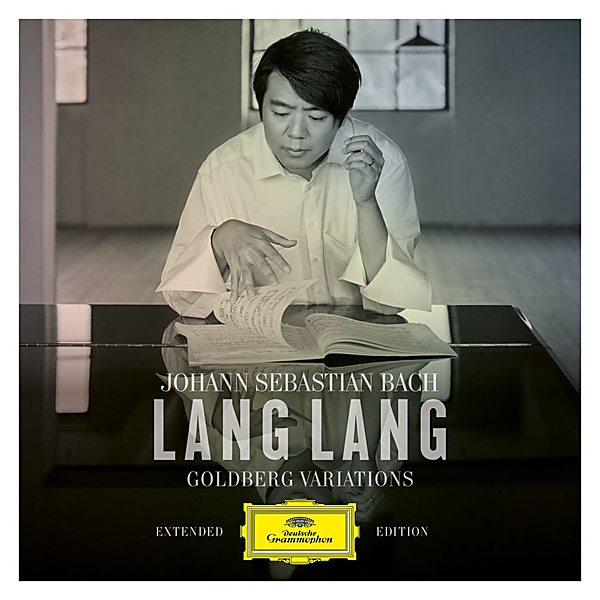

# Bach: Goldberg Variations (Extended Edt.)

By Lang Lang

## Album Data

- Catalog #: Roon
- Format: Digital, Album

## Track listing

1-1 Goldberg Variations, BWV 988: Aria
1-2 Goldberg Variations, BWV 988: Variatio 1 A1 Clav.
1-3 Goldberg Variations, BWV 988: Variatio 2 A1 Clav.
1-4 Goldberg Variations, BWV 988: Variatio 3 A1 Clav. Canone All'unisuono
1-5 Goldberg Variations, BWV 988: Variatio 4 A1 Clav.
1-6 Goldberg Variations, BWV 988: Variatio 5 A1 Ovvero 2 Clav.
1-7 Goldberg Variations, BWV 988: Variatio 6 A1 Clav. Canone Alla Seconda
1-8 Goldberg Variations, BWV 988: Variatio 7 A1 Ovvero 2 Clav. Al Tempo di Giga
1-9 Goldberg Variations, BWV 988: Variatio 8 A2 Clav.
1-10 Goldberg Variations, BWV 988: Variatio 9 A1 Clav. Canone Alla Terza
1-11 Goldberg Variations, BWV 988: Variatio 10 A1 Clav. Fughetta
1-12 Goldberg Variations, BWV 988: Variatio 11 A2 Clav.
1-13 Goldberg Variations, BWV 988: Variatio 12. Canoe Alla Quarta
1-14 Goldberg Variations, BWV 988: Variatio 13 A2 Clav.
1-15 Goldberg Variations, BWV 988: Variatio 14 A2 Clav.
1-16 Goldberg Variations, BWV 988: Variatio 15 A1 Clav. Canoen Alla Quinta
1-17 Goldberg Variations, BWV 988: Variatio 16 Ouverture. a 1 Clav.
1-18 Goldberg Variations, BWV 988: Variatio 17 a 2 Clav.
1-19 Goldberg Variations, BWV 988: Variatio 18 Canone alla Sesta. a 1 Clav.
1-20 Goldberg Variations, BWV 988: Variatio 19 a 1 Clav.
1-21 Goldberg Variations, BWV 988: Variatio 20 a 2 Clav.
1-22 Goldberg Variations, BWV 988: Variatio 21 Canone alla Settima. (a 1 Clav.)
1-23 Goldberg Variations, BWV 988: Variatio 22 a 1 Clav. Alla breve
1-24 Goldberg Variations, BWV 988: Variatio 23 a 2 Clav.
1-25 Goldberg Variations, BWV 988: Variatio 24 Canone all'Ottava. a 1 Clav.
1-26 Goldberg Variations, BWV 988: Variatio 25 a 2 Clav. Adagio
1-27 Goldberg Variations, BWV 988: Variatio 26 a 2 Clav.
1-28 Goldberg Variations, BWV 988: Variatio 27 Canone alla Nona. a 2 Clav.
1-29 Goldberg Variations, BWV 988: Variatio 28 a 2 Clav.
1-30 Goldberg Variations, BWV 988: Variatio 29 a 1 ovvero 2 Clav.
1-31 Goldberg Variations, BWV 988: Variatio 30 Quodlibet. a 1 Clav.
1-32 Goldberg Variations, BWV 988: Aria da Capo
2-1 Goldberg Variations, BWV 988: Aria (live at Thomaskirche, Leipzig, 2020)
2-2 Goldberg Variations, BWV 988: Variatio 1 a 1 Clav. (live at Thomaskirche, Leipzig, 2020)
2-3 Goldberg Variations, BWV 988: Variatio 2 a 1 Clav. (live at Thomaskirche, Leipzig, 2020)
2-4 Goldberg Variations, BWV 988: Variatio 3 Canone all'Unisono. a 1 Clav. (live at Thomaskirche, Leipzig, 2020)
2-5 Goldberg Variations, BWV 988: Variatio 4 a 1 Clav. (live at Thomaskirche, Leipzig, 2020)
2-6 Goldberg Variations, BWV 988: Variatio 5 a 1 ovvero 2 Clav. (live at Thomaskirche, Leipzig, 2020)
2-7 Goldberg Variations, BWV 988: Variatio 6 Canone alla Seconda. a 1 Clav. (live at Thomaskirche, Leipzig, 2020)
2-8 Goldberg Variations, BWV 988: Variatio 7 a 1 ovvero 2 Clav. Al tempo di Giga (live at Thomaskirche, Leipzig, 2020)
2-9 Goldberg Variations, BWV 988: Variatio 8 a 2 Clav. (live at Thomaskirche, Leipzig, 2020)
2-10 Goldberg Variations, BWV 988: Variatio 9 Canone alla Terza. a 1 Clav. (live at Thomaskirche, Leipzig, 2020)
2-11 Goldberg Variations, BWV 988: Variatio 10 Fughetta. a 1 Clav. (live at Thomaskirche, Leipzig, 2020)
2-12 Goldberg Variations, BWV 988: Variatio 11 a 2 Clav. (live at Thomaskirche, Leipzig, 2020)
2-13 Goldberg Variations, BWV 988: Variatio 12 Canone alla Quarta. (a 1 Clav.) (live at Thomaskirche, Leipzig, 2020)
2-14 Goldberg Variations, BWV 988: Variatio 13 a 2 Clav. (live at Thomaskirche, Leipzig, 2020)
2-15 Goldberg Variations, BWV 988: Variatio 14 a 2 Clav. (live at Thomaskirche, Leipzig, 2020)
2-16 Goldberg Variations, BWV 988: Variatio 15 Canone alla Quinta. a 1 Clav. Andante (live at Thomaskirche, Leipzig, 2020)
2-17 Goldberg Variations, BWV 988: Variatio 16 Ouverture. a 1 Clav. (live at Thomaskirche, Leipzig, 2020)
2-18 Goldberg Variations, BWV 988: Variatio 17 a 2 Clav. (live at Thomaskirche, Leipzig, 2020)
2-19 Goldberg Variations, BWV 988: Variatio 18 Canone alla Sesta. a 1 Clav. (live at Thomaskirche, Leipzig, 2020)
2-20 Goldberg Variations, BWV 988: Variatio 19 a 1 Clav. (live at Thomaskirche, Leipzig, 2020)
2-21 Goldberg Variations, BWV 988: Variatio 20 a 2 Clav. (live at Thomaskirche, Leipzig, 2020)
2-22 Goldberg Variations, BWV 988: Variatio 21 Canone alla Settima. (a 1 Clav.) (live at Thomaskirche, Leipzig, 2020)
2-23 Goldberg Variations, BWV 988: Variatio 22 a 1 Clav. Alla breve (live at Thomaskirche, Leipzig, 2020)
2-24 Goldberg Variations, BWV 988: Variatio 23 a 2 Clav. (live at Thomaskirche, Leipzig, 2020)
2-25 Goldberg Variations, BWV 988: Variatio 24 Canone all'Ottava. a 1 Clav. (live at Thomaskirche, Leipzig, 2020)
2-26 Goldberg Variations, BWV 988: Variatio 25 a 2 Clav. Adagio (live at Thomaskirche, Leipzig, 2020)
2-27 Goldberg Variations, BWV 988: Variatio 26 a 2 Clav. (live at Thomaskirche, Leipzig, 2020)
2-28 Goldberg Variations, BWV 988: Variatio 27 Canone alla Nona. a 2 Clav. (live at Thomaskirche, Leipzig, 2020)
2-29 Goldberg Variations, BWV 988: Variatio 28 a 2 Clav. (live at Thomaskirche, Leipzig, 2020)
2-30 Goldberg Variations, BWV 988: Variatio 29 a 1 ovvero 2 Clav. (live at Thomaskirche, Leipzig, 2020)
2-31 Goldberg Variations, BWV 988: Variatio 30 Quodlibet. a 1 Clav. (live at Thomaskirche, Leipzig, 2020)
2-32 Goldberg Variations, BWV 988: Aria da Capo (live at Thomaskirche, Leipzig, 2020)
3-1 Goldberg Variations, BWV 988: Aria (edit)
3-2 Goldberg Variations, BWV 988: Variatio 7 a 1 ovvero 2 Clav. Al tempo di Giga (edit)
3-3 Goldberg Variations, BWV 988: Variatio 13 a 2 Clav. (edit)
3-4 Goldberg Variations, BWV 988: Variatio 15 Canone alla Quinta. a 1 Clav. Andante (edit)
3-5 Goldberg Variations, BWV 988: Variatio 25 a 2 Clav. Adagio (edit)
3-6 Goldberg Variations, BWV 988: Variatio 26 a 2 Clav. (edit)
3-7 Goldberg Variations, BWV 988: Variatio 30 Quodlibet. a 1 Clav. (edit)
4-1 Bist du bei mir (Formerly Attrib. J.S. Bach as BWV 508, Arr. Anna Saradjian)
4-2 Sonata in D Major: II. Andante
4-3 Italian Concerto in F Major, BWV 971: II. Andante
4-4 Hunting Cantata, BWV 208: No. 9. Sheep May Safely Graze (Transc. Duck for 4 Hands)
4-5 Flute Sonata in E Flat Major, BWV 1031: II. Siciliano (Transc. Kempff)
4-6 Christmas Oratorio, BWV 248: X. Sinfonia (Arr. Anna Saradjian)
4-7 Arabesque in C major, op. 18 (live at Thomaskirche, Leipzig, 2020)

