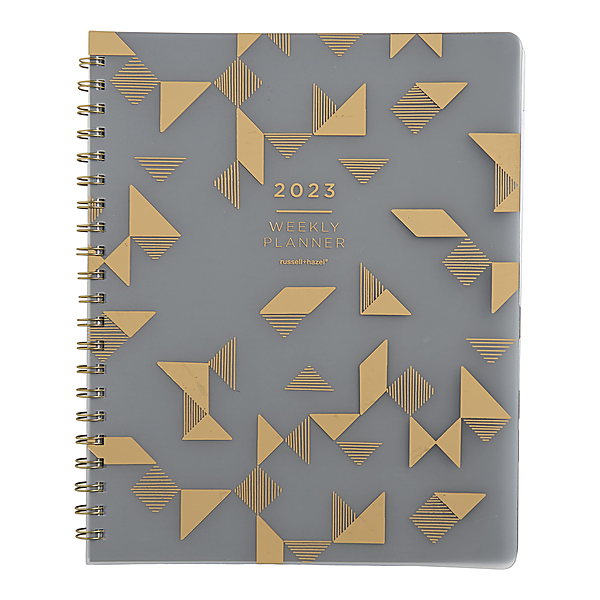

# Asylum Choir II (Bonus Track Version)

By Leon Russell

## Album Data

- Catalog #: Roon
- Format: Digital, Album

## Track listing

1. Sweet Home Chicago
2. Down on the Base
3. Hello Little Friend
4. Salty Candy
5. Tryin' to Stay 'Live
6. ...Intro to Rita...
7. Straight Brother
8. Learn How to Boogie
9. Ballad for a Soldier
10. When You Wish Upon a Fag
11. Lady in Waiting
12. Welcome to Hollywood
13. Death of the Flowers
14. Icicle Star Tree
15. Mr. Henri the Clown
16. Soul Food

## See also

- [Carney](Carney.md)
- [Leon Live (Live)](Leon_Live_Live.md)
- [Leon Russell And The Shelter People (Remastered 2013)](Leon_Russell_And_The_Shelter_People_Remastered_2013.md)
- [Leon Russell](Leon_Russell.md)
- [Live At Gilley's (Live)](Live_At_Gilleys_Live.md)
- [Looking Back](Looking_Back.md)
- [The Live Album (Live)](The_Live_Album_Live.md)
- [Will O' The Wisp](Will_O_The_Wisp.md)
- [Beets: Anything Can Happen](../../Beets/Leon_Russell/Anything_Can_Happen.md)
- [Beets: Carney](../../Beets/Leon_Russell/Carney.md)
- [Beets: Hank Wilson, Vol. 3](../../Beets/Leon_Russell/Hank_Wilson__Vol_3.md)
- [Beets: Leon Russell](../../Beets/Leon_Russell/Leon_Russell.md)
- [CD: Asylum Choir II](../../CD/Leon_Russell/Asylum_Choir_II.md)
- [CD: ](../../CD/Leon_Russell/Leon_Russell_index.md)
- [CD: Leon Russell](../../CD/Leon_Russell/Leon_Russell.md)
- [Vinyl: Carney](../../Vinyl/Leon_Russell/Carney.md)
- [Vinyl: Hank Wilson's Back Vol. I](../../Vinyl/Leon_Russell/Hank_Wilsons_Back_Vol_I.md)
- [Vinyl: ](../../Vinyl/Leon_Russell/Leon_Russell_index.md)
- [Vinyl: Leon Russell](../../Vinyl/Leon_Russell/Leon_Russell.md)
