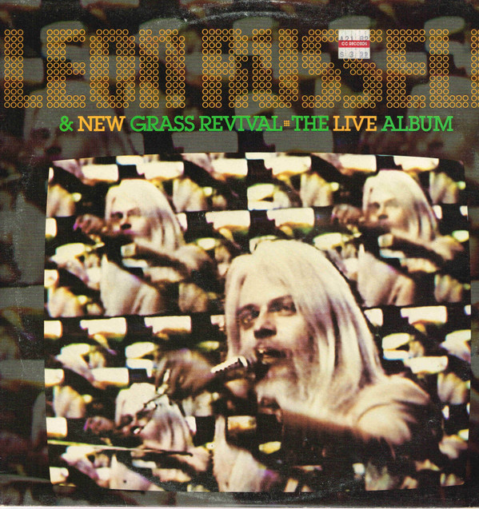

# The Live Album (Live)

By Leon Russell

## Album Data

- Catalog #: Roon
- Format: Digital, Album

## Track listing

1. Over the Rainbow
2. I've Just Seen a Face
3. One More Love Song
4. Pilgrim Land
5. Georgia Blues
6. I Believe to My Soul
7. Prince of Peace
8. Rollin' in My Sweet Baby's Arms
9. Stranger in a Strange Land
10. I Want to Be at the Meeting
11. Wild Horses
12. Jambalaya (On the Bayou)
13. Caribbean
14. Jumpin' Jack Flash

## See also

- [Asylum Choir II (Bonus Track Version)](Asylum_Choir_II_Bonus_Track_Version.md)
- [Carney](Carney.md)
- [Leon Live (Live)](Leon_Live_Live.md)
- [Leon Russell And The Shelter People (Remastered 2013)](Leon_Russell_And_The_Shelter_People_Remastered_2013.md)
- [Leon Russell](Leon_Russell.md)
- [Live At Gilley's (Live)](Live_At_Gilleys_Live.md)
- [Looking Back](Looking_Back.md)
- [Will O' The Wisp](Will_O_The_Wisp.md)
- [Beets: Anything Can Happen](../../Beets/Leon_Russell/Anything_Can_Happen.md)
- [Beets: Carney](../../Beets/Leon_Russell/Carney.md)
- [Beets: Hank Wilson, Vol. 3](../../Beets/Leon_Russell/Hank_Wilson__Vol_3.md)
- [Beets: Leon Russell](../../Beets/Leon_Russell/Leon_Russell.md)
- [CD: Asylum Choir II](../../CD/Leon_Russell/Asylum_Choir_II.md)
- [CD: ](../../CD/Leon_Russell/Leon_Russell_index.md)
- [CD: Leon Russell](../../CD/Leon_Russell/Leon_Russell.md)
- [Vinyl: Carney](../../Vinyl/Leon_Russell/Carney.md)
- [Vinyl: Hank Wilson's Back Vol. I](../../Vinyl/Leon_Russell/Hank_Wilsons_Back_Vol_I.md)
- [Vinyl: ](../../Vinyl/Leon_Russell/Leon_Russell_index.md)
- [Vinyl: Leon Russell](../../Vinyl/Leon_Russell/Leon_Russell.md)
