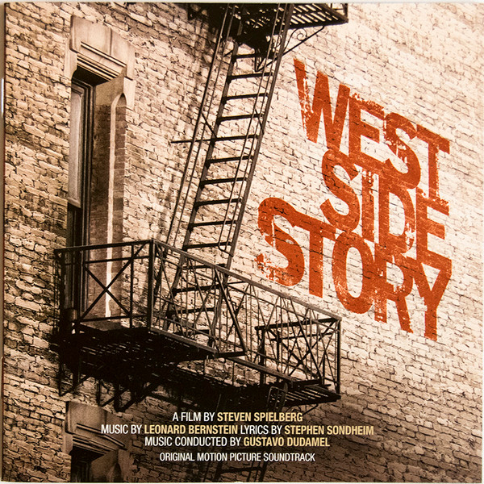

# West Side Story (Original Motion Picture Soundtrack)

By Leonard Bernstein

## Album Data

- Catalog #: Roon
- Format: Digital, Album

## Track listing

1. West Side Story: Prologue
2. West Side Story: La Borinqueña (Sharks Version)
3. West Side Story: Jet Song
4. West Side Story: Something's Coming
5. West Side Story: The Dance at the Gym: Blues, Promenade
6. West Side Story: The Dance at the Gym: Mambo
7. West Side Story: The Dance at the Gym: Cha-Cha, Meeting Scene, Jump
8. West Side Story: Maria
9. West Side Story: Balcony Scene (Tonight)
10. West Side Story: Transition to Scherzo / Scherzo
11. West Side Story: America
12. West Side Story: Gee, Officer Krupke
13. West Side Story: One Hand, One Heart
14. West Side Story: Cool
15. West Side Story: Tonight (Quintet)
16. West Side Story: The Rumble
17. West Side Story: I Feel Pretty
18. West Side Story: Somewhere
19. West Side Story: A Boy Like That / I Have a Love
20. West Side Story: Finale
21. West Side Story: End Credits

