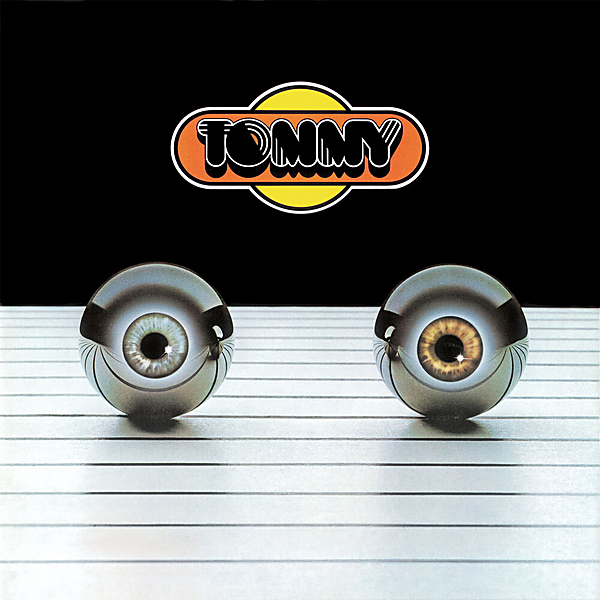

# Tommy as Performed by The London Symphony Orchestra and Chambre Choir with Guest Soloists (Remastered)

By London Symphony Orchestra

## Album Data

- Catalog #: Roon
- Format: Digital, Album

## Track listing

1. Overture
2. It's a Boy
3. 1921
4. Amazing Journey
5. Sparks
6. Eyesight to the Blind
7. Christmas
8. Cousin Kevin
9. The Acid Queen
10. Underture
11. Do You Think It's Alright
12. Fiddle About
13. Pinball Wizard
14. There's a Doctor I've Found
15. Go to the Mirror Boy
16. Tommy Can You Hear Me?
17. Smash the Mirror
18. I'm Free
19. Miracle Cure
20. Sensation
21. Sally Simpson
22. Welcome
23. Tommy's Holiday Camp
24. We're Not Gonna Take It
25. See Me, Feel Me (Finale from, We're Not Gonna Take It)

