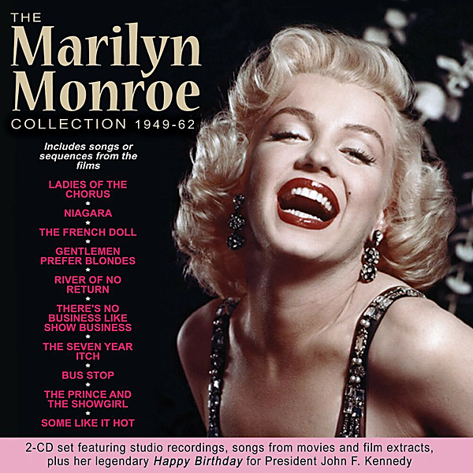

# The Marilyn Monroe Collection 1949-62

By Marilyn Monroe

## Album Data

- Catalog #: Roon
- Format: Digital, Album

## Track listing

1-1 Ladies of the Chorus
1-2 Every Baby Neeeds a Da Da Daddy
1-3 Anyone Can See I Love You
1-4 Kiss
1-5 Do It Again
1-6 Two Little Girls From Little Rock
1-7 Bye Bye
1-8 Diamonds Are a Girl's Best Friend
1-9 When Love Goes Wrong
1-10 She Acts Like a Woman Should
1-11 (This Is) A Fine Romance
1-12 The River of No Return
1-13 I'm Gonna File My Claim
1-14 One Silver Dollar
1-15 Down in the Meadow
1-16 After You Get What You Want You Won't Want It
1-17 Heat Wave
2-1 A Man Chases a Girl
2-2 Lazy
2-3 You'd Be Surprised
2-4 Alexander's Ragtime Band/There's No Business Like Show Business
2-5 Rachmaninov & Chopsticks
2-6 That Old Black Magic
2-7 I Found a Dream
2-8 I'm Through With Love
2-9 I Wanna Be Loved by You
2-10 Running Wild
2-11 Some Like It Hot
2-12 My Heart Belongs to Daddy
2-13 Let's Make Love
2-14 Incurably Romantic
2-15 Incurably Romantic
2-16 Specialization
2-17 Happy Birthday Mr. President/Thanks for the Memory

