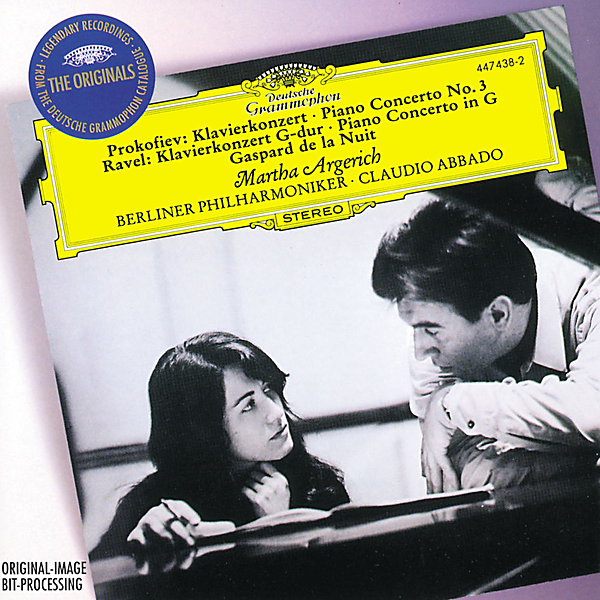

# Prokofiev: Piano Concerto No.3 / Ravel: Piano Concerto In G Major

By Martha Argerich

## Album Data

- Catalog #: Roon
- Format: Digital, Album

## Track listing

1. Piano Concerto No. 3 in C major, Op. 26: Andante - Allegro
2. Piano Concerto No. 3 in C major, Op. 26: Theme and Variations. Andantino
3. Piano Concerto No. 3 in C major, Op. 26: Allegro, Ma Non Troppo
4. Piano Concerto in G major: I. Allegramente
5. Piano Concerto in G major: II. Adagio assai
6. Piano Concerto in G major: III. Presto
7. Gaspard de la nuit, for piano: No. 1, Ondine
8. Gaspard de la nuit, for piano: No. 2, Le gibet
9. Gaspard de la nuit, for piano: No. 3, Scarbo

## See also

- [Chopin](Chopin-_Piano_Concerto_No_1_-_Liszt-_Piano_Concerto_No_1.md)
- [J.S. Bach](JS_Bach-_Toccata_In_C_Minor_BWV_911;_Partita_No2_In_C_Minor__BWV_826;_English_Suite_No2_In_A_Minor__BWV_807.md)
- [Rachmaninov](Rachmaninov-_Piano_Concerto_No3_-_Tchaikovsky-_Piano_Concerto_No1_Live.md)
