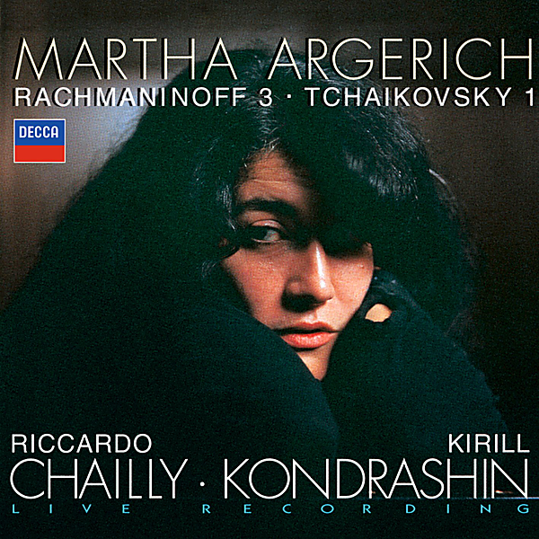

# Rachmaninov: Piano Concerto No.3 / Tchaikovsky: Piano Concerto No.1 (Live)

By Martha Argerich

## Album Data

- Catalog #: Roon
- Format: Digital, Album

## Track listing

1. Piano Concerto No. 3 in D minor, Op. 30: 1. Allegro ma non tanto
2. Piano Concerto No. 3 in D minor, Op. 30: 2. Intermezzo. Adagio
3. Piano Concerto No. 3 in D minor, Op. 30: 3. Finale. Alla breve
4. Piano Concerto No. 1 in B flat minor, Op. 23: 1. Allegro non troppo e molto maestoso - Allegro con spirito
5. Piano Concerto No. 1 in B flat minor, Op. 23: 2. Andantino simplice - Prestissimo - Tempo I
6. Piano Concerto No. 1 in B flat minor, Op. 23: 3. Allegro con fuoco

