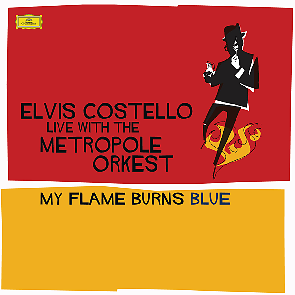

# Costello: My Flame Burns Blue

By Metropole Orkest

## Album Data

- Catalog #: Roon
- Format: Digital, Album

## Track listing

1-1 Hora Decubitus
1-2 Favourite Hour
1-3 That's How You Got Killed Before
1-4 Upon a Veil of Midnight Blue
1-5 Clubland
1-6 Almost Blue
1-7 Speak Darkly My Angel
1-8 Almost Ideal Eyes
1-9 Can You Be True?
1-10 Put Away Forbidden Playthings
1-11 Episode of Blonde
1-12 My Flame Burns Blue (Blood Count)
1-13 Watching the Detectives
1-14 God Give Me Strength
2-1 Prelude [Edit]
2-2 Overture [Edit]
2-3 Puck One [Edit]
2-4 The Court [Edit]
2-5 Workers' Playtime [Edit]
2-6 Oberon and Titania [Edit]
2-7 The Conspiracy of Oberon and Puck [Edit]
2-8 Puck Two [Edit]
2-9 The Identity Parade [Edit]
2-10 The Face of Bottom [Edit]
2-11 The Spark of Love [Edit]
2-12 Tormentress [Edit]
2-13 Oberon Humbeld [Edit]
2-14 Twisted - Entangled - Transform and Exchange [Edit]
2-15 The Fairy and the Ass [Edit]
2-16 Sleep [Edit]
2-17 The Play [Edit]
2-18 The Wedding [Edit]

