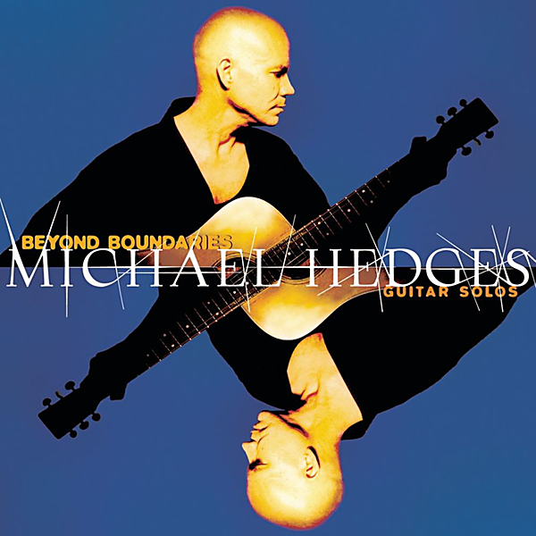

# Beyond Boundaries: Guitar Solos

By Michael Hedges

## Album Data

- Catalog #: Roon
- Format: Digital, Album

## Track listing

1. Rickover's Dream
2. Aerial Boundaries
3. Eleven Small Roaches
4. Ragamuffin
5. Ritual Dance
6. Chava's Song
7. The Double Planet
8. Jitterboogie
9. Java Man
10. Bensusan
11. Because It's There
12. The Unexpected Visitor
13. The 2nd Law
14. Baal T'Shuvah
15. The Funky Avocado
16. Dream Beach
17. Gospel
18. Sofa No. 1
19. Rickover's Dream (2)

## See also

- [Aerial Boundaries](Aerial_Boundaries.md)
- [Breakfast In The Field](Breakfast_In_The_Field.md)
- [Live On The Double Planet](Live_On_The_Double_Planet.md)
- [Oracle](Oracle.md)
- [Platinum & Gold Collection](Platinum_and_Gold_Collection.md)
- [Pure Michael Hedges](Pure_Michael_Hedges.md)
- [Taproot](Taproot.md)
- [Torched](Torched.md)
- [Watching My Life Go By](Watching_My_Life_Go_By.md)
- [Beets: Live 07/23/95 Enid, OK](../../Beets/Michael_Hedges/Live_07-23-95_Enid__OK.md)
- [Beets: Live at SUNY Binghamton, 5 May](../../Beets/Michael_Hedges/Live_at_SUNY_Binghamton__5_May.md)
- [Beets: The Road to Return](../../Beets/Michael_Hedges/The_Road_to_Return.md)
