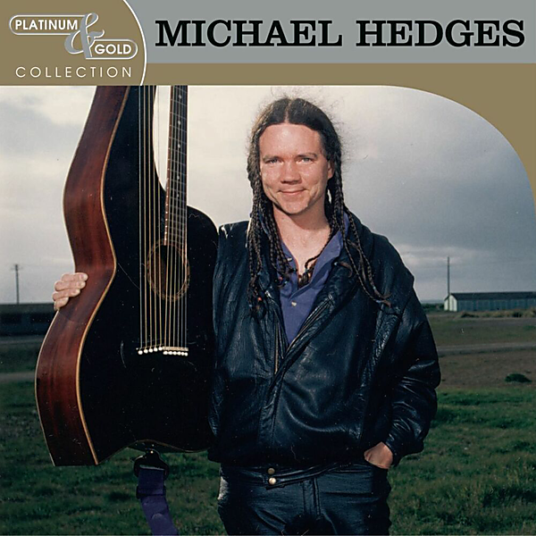

# Platinum & Gold Collection

By Michael Hedges

## Album Data

- Catalog #: Roon
- Format: Digital, Album

## Track listing

1. Aerial Boundaries
2. Because It's There
3. The Double Planet
4. Ritual Dance
5. Tomorrow Never Knows
6. All Along the Watchtower
7. After the Gold Rush
8. Oracle
9. Woman of the World
10. Two Days Old
11. Bensusan
12. Ignition

## See also

- [Aerial Boundaries](Aerial_Boundaries.md)
- [Beyond Boundaries](Beyond_Boundaries-_Guitar_Solos.md)
- [Breakfast In The Field](Breakfast_In_The_Field.md)
- [Live On The Double Planet](Live_On_The_Double_Planet.md)
- [Oracle](Oracle.md)
- [Pure Michael Hedges](Pure_Michael_Hedges.md)
- [Taproot](Taproot.md)
- [Torched](Torched.md)
- [Watching My Life Go By](Watching_My_Life_Go_By.md)
- [Beets: Live 07/23/95 Enid, OK](../../Beets/Michael_Hedges/Live_07-23-95_Enid__OK.md)
- [Beets: Live at SUNY Binghamton, 5 May](../../Beets/Michael_Hedges/Live_at_SUNY_Binghamton__5_May.md)
- [Beets: The Road to Return](../../Beets/Michael_Hedges/The_Road_to_Return.md)
