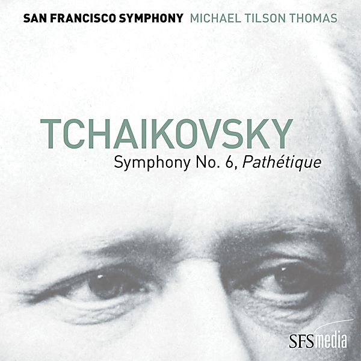

# Tchaikovsky: Symphony No. 6, "Pathétique"

By Michael Tilson Thomas

## Album Data

- Catalog #: Roon
- Format: Digital, Album

## Track listing

1. Symphony No. 6 in B Minor, Op. 74, "Pathétique": I. Adagio - Allegro non troppo
2. Symphony No. 6 in B Minor, Op. 74, "Pathétique": II. Allegro con grazia
3. Symphony No. 6 in B Minor, Op. 74, "Pathétique": III. Allegro molto vivace
4. Symphony No. 6 in B Minor, Op. 74, "Pathétique": IV. Finale - Adagio lamentoso - Andante

