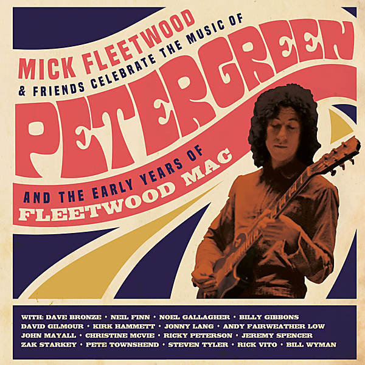

# Celebrate the Music of Peter Green and the Early Years of Fleetwood Mac (Live from The London Palladium)

By Mick Fleetwood

## Album Data

- Catalog #: Roon
- Format: Digital, Album

## Track listing

1. Rolling Man
2. Homework
3. Doctor Brown
4. All Your Love
5. Rattlesnake Shake
6. Stop Messin' Round
7. Looking for Somebody
8. Sandy Mary
9. Love That Burns
10. The World Keep on Turning
11. Like Crying
12. No Place to Go
13. Station Man
14. Man of the World
15. Oh Well, Pt. 1
16. Oh Well, Pt. 2
17. Need Your Love So Bad
18. Black Magic Woman
19. The Sky Is Crying
20. I Can't Hold Out
21. The Green Manalishi (With the Two Prong Crown)
22. Albatross
23. Shake Your Money Maker

