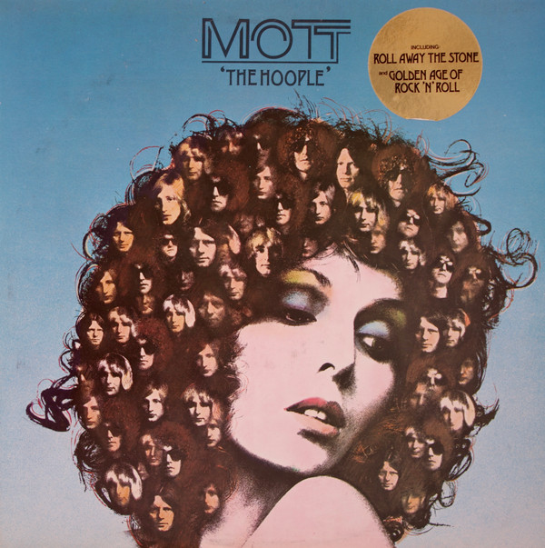

# The Hoople

By Mott the Hoople

## Album Data

- Catalog #: Roon
- Format: Digital, Album

## Track listing

1. The Golden Age of Rock & Roll
2. Marionette
3. Alice
4. Crash Street Kidds
5. Born Late '58
6. Trudi's Song
7. Pearl 'n' Roy (England)
8. Through the Looking Glass (alternate version)
9. Roll Away the Stone
10. Where Do You All Come From (non LP B‐side)
11. Rest in Peace (non LP B‐side)
12. Foxy Foxy
13. (Do You Remember) The Saturday Gigs? (alternate version)
14. The Saturday Kids
15. Lounge Lizzard
16. The Golden Age Of Rock 'N' Roll (Live From Broadway)

